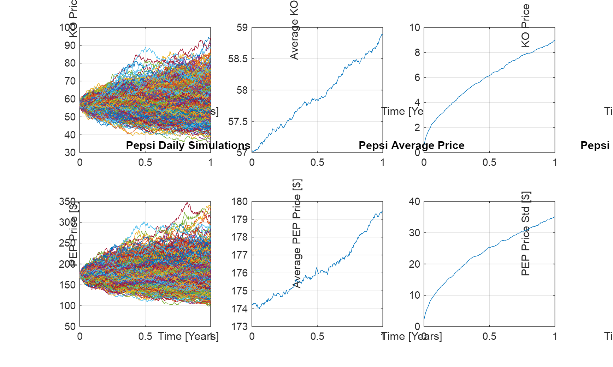
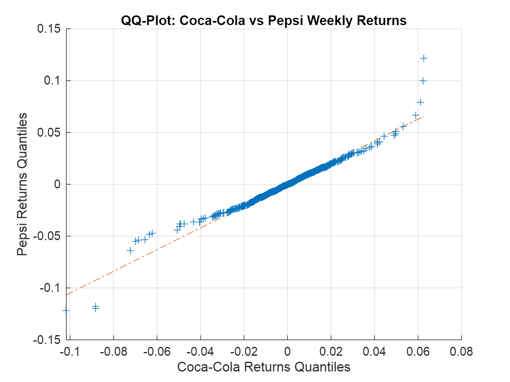
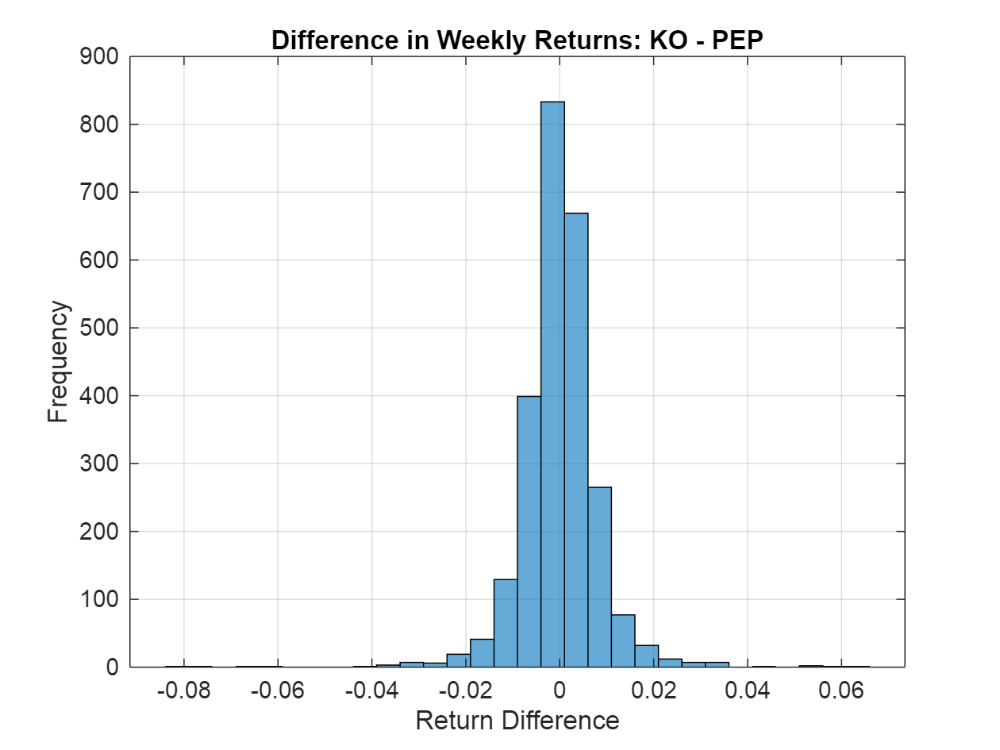
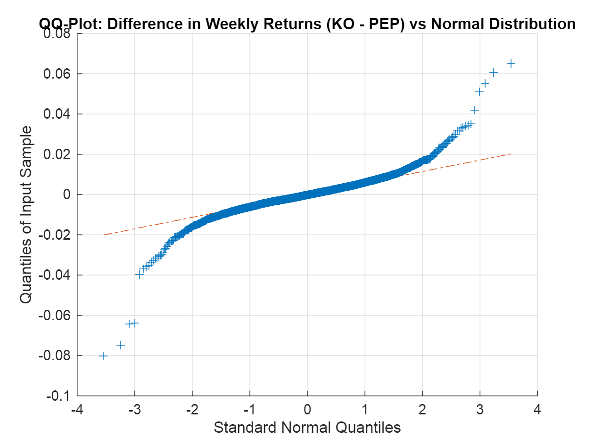

# Class 2 Homework \- Xinyi (Cynthia) Shen
# Problem 2

Using a Geometric Brownian Motion, simulate the Coke and Pepsi stock prices on a yearly, monthly, and daily basis.

\begin{itemize}
\setlength{\itemsep}{-1ex}
   \item{ KO: Coca Cola closed on Sep 24th 2023 at USD \$\mu $74 on Sep 24th 2023. Options suggset that the forward volatility is 20\% per year. \end{flushleft}}   \item{\begin{flushleft} PEP: Has a dividend yield of 2.76\%. \end{flushleft}}\end{itemize}\matlabheading{Homework}\begin{itemize}\setlength{\itemsep}{-1ex}   \item{\begin{flushleft} \textbf{Question 1:} Simulate the daily time series for Coke and for Pepsi over the next year. Be clear with your assumptions and how you arrived at them. \end{flushleft}}   \item{\begin{flushleft} \textbf{Question 2: }Compare the year end histograms for both simulations. \end{flushleft}}   \item{\begin{flushleft} \textbf{Question 3:} Download historical data for KO and PEP. Calculate the weekly returns for the past 10 years. Draw the QQ-Plot of KO vs. PEP. Do they come from the same distribution? \end{flushleft}}   \item{\begin{flushleft} \textbf{Question 4:} Calculate the difference in weekly returns between KO and PEP. Does this come from a normal distribution? \end{flushleft}}\end{itemize}\matlabheadingtwo{Question 1}\begin{flushleft}Simulate the daily time series for Coke and for Pepsi over the next year.\end{flushleft}\begin{flushleft}Assume that the stock prices of Coke and Pepsi follow the Geometric Brownian Motion (GBM):\end{flushleft}$ $dS_t =\mu S_t dt+\sigma S_t dW_t$ $\begin{flushleft}where\end{flushleft}\begin{itemize}\setlength{\itemsep}{-1ex}   \item{\begin{flushleft} $ S_t $ is the stock price at time $ t $ \end{flushleft}}   \item{\begin{flushleft} $ \mu $ is the drift \end{flushleft}}   \item{\begin{flushleft} $ \sigma $ is the volatility \end{flushleft}}   \item{\begin{flushleft} $ dW_t $ is the random component of Brownian motion (standard normal random increments) \end{flushleft}}   \item{\begin{flushleft} $ dt $ is the time increment \end{flushleft}}\end{itemize}\begin{flushleft}Stock prices of Coke and Pepsi over the next year are\end{flushleft}$ $S_{t+1} =S_t (1+r_t )$ $\begin{flushleft}where $ r_t $ follows the discrete-time version of the GBM model\end{flushleft}$ $r_t =\mu dt+\sigma \sqrt{dt}Z_t$ $\begin{flushleft}where $ Z_t \sim N(0,1) $.\end{flushleft}```matlab% Parameters for Coca-Cola (KO)So_KO = 57;      % Initial stock price [Coca-Cola]mu_KO = 0.0319;  % Drift (annualized dividend yield)sigma_KO = 0.15; % Volatility (annualized)
% Parameters for Pepsi (PEP)So_PEP = 174;     % Initial stock price [Pepsi]mu_PEP = 0.0276;  % Drift (annualized dividend yield)sigma_PEP = 0.20; % Volatility (annualized)
% Time parametersT = 1;           % Maturity [1 year]NSteps = 252;    % Daily steps (252 trading days in a year)NTrials = 1000;  % Number of simulations (Monte Carlo trials)
% Time discretizationt = linspace(0, T, NSteps)';  % Time vectordt = T / NSteps;              % Time step
% Simulating Coca-Cola (KO)U_KO = rand(NSteps, NTrials);         % Generate random variablesZ_KO = norminv(U_KO);                 % Standard normal variablesr_KO = mu_KO * dt * ones(size(U_KO)) + sigma_KO * sqrt(dt) * Z_KO;  % Simulate returnsS_KO = So_KO * cumprod(1 + r_KO);     % Simulate stock price paths over the next year
% Simulating Pepsi (PEP)U_PEP = rand(NSteps, NTrials);        % Generate random variablesZ_PEP = norminv(U_PEP);               % Standard normal variablesr_PEP = mu_PEP * dt * ones(size(U_PEP)) + sigma_PEP * sqrt(dt) * Z_PEP;  % Simulate returnsS_PEP = So_PEP * cumprod(1 + r_PEP);  % Simulate stock price paths over the next year
% Plotting the Results for Coca-Cola (KO)figure()set(gcf, "position", [1, 1, 1000, 600])
subplot(2, 3, 1)plot(t, S_KO)  % Plot stock price pathsgrid onxlabel('Time [Years]');ylabel('KO Price [$ ]');
title('Coca-Cola Daily Simulations');

subplot(2, 3, 2)
plot(t, mean(S_KO, 2))  % Plot the average price across simulations
grid on
xlabel('Time [Years]');
ylabel('Average KO Price [ $]');title('Coca-Cola Average Price');
subplot(2, 3, 3)plot(t, std(S_KO, 0, 2))  % Plot the standard deviation across simulationsgrid onxlabel('Time [Years]');ylabel('KO Price Std [$ ]');
title('Coca-Cola Price Variance');

% Plotting the Results for Pepsi (PEP)
subplot(2, 3, 4)
plot(t, S_PEP)  % Plot stock price paths
grid on
xlabel('Time [Years]');
ylabel('PEP Price [ $]');title('Pepsi Daily Simulations');
subplot(2, 3, 5)plot(t, mean(S_PEP, 2))  % Plot the average price across simulationsgrid onxlabel('Time [Years]');ylabel('Average PEP Price [$ ]');
title('Pepsi Average Price');

subplot(2, 3, 6)
plot(t, std(S_PEP, 0, 2))  % Plot the standard deviation across simulations
grid on
xlabel('Time [Years]');
ylabel('PEP Price Std [ $]');title('Pepsi Price Variance');```
\begin{center}\end{center}\matlabheadingthree{\textbf{Question 2}}\begin{flushleft}Compare the year end histograms for both simulations.\end{flushleft}```matlab% Extract year-end prices (last row) for KO and PEPyear_end_KO = S_KO(end, :);      % Year-end prices for KOyear_end_PEP = S_PEP(end, :);    % Year-end prices for PEP
% Plot histograms of year-end prices for both KO and PEPfigure;subplot(1, 2, 1);histogram(year_end_KO, 30, 'Normalization', 'probability');title('Year-End Price Distribution for KO');xlabel('Year-End Price [$ ]');
ylabel('Probability');
grid on;

subplot(1, 2, 2);
histogram(year_end_PEP, 30, 'Normalization', 'probability');
title('Year-End Price Distribution for PEP');
xlabel('Year-End Price [ $]');ylabel('Probability');grid on;
% Set the same y-limits for comparisonylim([0, 0.2]);```
\begin{center}\end{center}\matlabheadingthree{Question 3}\begin{flushleft}Download historical data for KO and PEP for the past 10 years.\end{flushleft}```matlab% Use Python's yfinance to download KO and PEP historical data for the last 10 yearsKO_data = py.yfinance.download('KO', pyargs('period', '10y', 'interval', '1d'));```
\begin{matlaboutput}[*********************100%***********************]  1 of 1 completed\end{matlaboutput}```matlabPEP_data = py.yfinance.download('PEP', pyargs('period', '10y', 'interval', '1d'));```
\begin{matlaboutput}[*********************100%***********************]  1 of 1 completed\end{matlaboutput}```matlab% Convert dataframe to tableKO_table = table(KO_data);PEP_table = table(PEP_data);
% Extract Adj Close as arrayKO_AdjClose = table2array(KO_table(:, "Adj Close"));PEP_AdjClose = table2array(PEP_table(:, "Adj Close"));```
\begin{flushleft}Calculate the weekly returns for KO and PEP.\end{flushleft}```matlab% Calculate weekly log returns for KO and PEPreturns_KO = diff(log(KO_AdjClose));    % Log returns for KOreturns_PEP = diff(log(PEP_AdjClose));  % Log returns for PEP```
\begin{flushleft}Draw the QQ-Plot of KO vs. PEP.\end{flushleft}```matlab% Plot QQ-Plot comparing KO and PEP weekly returnsfigure();qqplot(returns_KO, returns_PEP);title('QQ-Plot: Coca-Cola vs Pepsi Weekly Returns');xlabel('Coca-Cola Returns Quantiles');ylabel('Pepsi Returns Quantiles');grid on;```
\begin{center}\end{center}\begin{flushleft}The points on the QQ-Plot fall on a straight line, which suggests that the distributions of KO and PEP are similar, meaning they could come from the same distribution.\end{flushleft}\matlabheadingthree{Question 4}\hfill \break```matlab% Step 1: Calculate the difference in weekly returns between KO and PEPreturns_diff = returns_KO - returns_PEP```
\begin{matlaboutput}returns_diff = 2516x1    0.0103    0.0066   -0.0011   -0.0019    0.0152    0.0102    0.0053   -0.0114    0.0021   -0.0015
\end{matlaboutput}```matlab% Step 2: Plot a histogram of the return differences to visualize the distributionfigure;histogram(returns_diff, 30);title('Difference in Weekly Returns: KO - PEP');xlabel('Return Difference');ylabel('Frequency');grid on;```
\begin{center}\end{center}```matlab% Step 3: Plot a QQ-Plot to compare the difference in returns against a normal distributionfigure;qqplot(returns_diff);title('QQ-Plot: Difference in Weekly Returns (KO - PEP) vs Normal Distribution');grid on;```
\begin{center}\end{center}```matlab% Step 4: Kolmogorov-Smirnov test for normality[h_ks, p_ks] = kstest(returns_diff);
if h_ks == 0    disp('The difference in returns follows a normal distribution (fail to reject the null hypothesis).');else    disp('The difference in returns does not follow a normal distribution (reject the null hypothesis).');end```
\begin{matlaboutput}The difference in returns does not follow a normal distribution (reject the null hypothesis).\end{matlaboutput}```matlabdisp(['Kolmogorov-Smirnov test p-value: ', num2str(p_ks)]);```
\begin{matlaboutput}Kolmogorov-Smirnov test p-value: 0\end{matlaboutput}```matlab% Import swtest from MATLAB File Exchangefunction [H, pValue, W] = swtest(x, alpha)%SWTEST Shapiro-Wilk parametric hypothesis test of composite normality.%   [H, pValue, SWstatistic] = SWTEST(X, ALPHA) performs the%   Shapiro-Wilk test to determine if the null hypothesis of%   composite normality is a reasonable assumption regarding the%   population distribution of a random sample X. The desired significance %   level, ALPHA, is an optional scalar input (default = 0.05).%%   The Shapiro-Wilk and Shapiro-Francia null hypothesis is: %   "X is normal with unspecified mean and variance."%%   This is an omnibus test, and is generally considered relatively%   powerful against a variety of alternatives.%   Shapiro-Wilk test is better than the Shapiro-Francia test for%   Platykurtic sample. Conversely, Shapiro-Francia test is better than the%   Shapiro-Wilk test for Leptokurtic samples.%%   When the series 'X' is Leptokurtic, SWTEST performs the Shapiro-Francia%   test, else (series 'X' is Platykurtic) SWTEST performs the%   Shapiro-Wilk test.% %    [H, pValue, SWstatistic] = SWTEST(X, ALPHA)%% Inputs:%   X - a vector of deviates from an unknown distribution. The observation%     number must exceed 3 and less than 5000.%% Optional inputs:%   ALPHA - The significance level for the test (default = 0.05).%  % Outputs:%  SWstatistic - The test statistic (non normalized).%%   pValue - is the p-value, or the probability of observing the given%     result by chance given that the null hypothesis is true. Small values%     of pValue cast doubt on the validity of the null hypothesis.%%     H = 0 => Do not reject the null hypothesis at significance level ALPHA.%     H = 1 => Reject the null hypothesis at significance level ALPHA.%%%%%%%%%%%%%%%%%%%%%%%%%%%%%%%%%%%%%%%%%%%%%%%%%%%%%%%%%%%%%%%%%%%%%%%%%%%%                Copyright (c) 17 March 2009 by Ahmed Ben Sa�da          %%                 Department of Finance, IHEC Sousse - Tunisia           %%                       Email: ahmedbensaida@yahoo.com                   %%                   $ Revision 3.0 $ Date: 18 Juin 2014 $               %
%%%%%%%%%%%%%%%%%%%%%%%%%%%%%%%%%%%%%%%%%%%%%%%%%%%%%%%%%%%%%%%%%%%%%%%%%%
%
% References:
%
% - Royston P. "Remark AS R94", Applied Statistics (1995), Vol. 44,
%   No. 4, pp. 547-551.
%   AS R94 -- calculates Shapiro-Wilk normality test and P-value
%   for sample sizes 3 <= n <= 5000. Handles censored or uncensored data.
%   Corrects AS 181, which was found to be inaccurate for n > 50.
%   Subroutine can be found at: http://lib.stat.cmu.edu/apstat/R94
%
% - Royston P. "A pocket-calculator algorithm for the Shapiro-Francia test
%   for non-normality: An application to medicine", Statistics in Medecine
%   (1993a), Vol. 12, pp. 181-184.
%
% - Royston P. "A Toolkit for Testing Non-Normality in Complete and
%   Censored Samples", Journal of the Royal Statistical Society Series D
%   (1993b), Vol. 42, No. 1, pp. 37-43.
%
% - Royston P. "Approximating the Shapiro-Wilk W-test for non-normality",
%   Statistics and Computing (1992), Vol. 2, pp. 117-119.
%
% - Royston P. "An Extension of Shapiro and Wilk's W Test for Normality
%   to Large Samples", Journal of the Royal Statistical Society Series C
%   (1982a), Vol. 31, No. 2, pp. 115-124.
%
%
% Ensure the sample data is a VECTOR.
%
if numel(x) == length(x)
    x  =  x(:);               % Ensure a column vector.
else
    error(' Input sample ''X'' must be a vector.');
end
%
% Remove missing observations indicated by NaN's and check sample size.
%
x  =  x(~isnan(x));
if length(x) < 3
   error(' Sample vector ''X'' must have at least 3 valid observations.');
end
if length(x) > 5000
    warning('Shapiro-Wilk test might be inaccurate due to large sample size ( > 5000).');
end
%
% Ensure the significance level, ALPHA, is a 
% scalar, and set default if necessary.
%
if (nargin >= 2) && ~isempty(alpha)
   if ~isscalar(alpha)
      error(' Significance level ''Alpha'' must be a scalar.');
   end
   if (alpha <= 0 || alpha >= 1)
      error(' Significance level ''Alpha'' must be between 0 and 1.'); 
   end
else
   alpha  =  0.05;
end
% First, calculate the a's for weights as a function of the m's
% See Royston (1992, p. 117) and Royston (1993b, p. 38) for details
% in the approximation.
x       =   sort(x); % Sort the vector X in ascending order.
n       =   length(x);
mtilde  =   norminv(((1:n)' - 3/8) / (n + 1/4));
weights =   zeros(n,1); % Preallocate the weights.
if kurtosis(x) > 3
    
    % The Shapiro-Francia test is better for leptokurtic samples.
    
    weights =   1/sqrt(mtilde'*mtilde) * mtilde;
    %
    % The Shapiro-Francia statistic W' is calculated to avoid excessive
    % rounding errors for W' close to 1 (a potential problem in very
    % large samples).
    %
    W   =   (weights' * x)^2 / ((x - mean(x))' * (x - mean(x)));
    % Royston (1993a, p. 183):
    nu      =   log(n);
    u1      =   log(nu) - nu;
    u2      =   log(nu) + 2/nu;
    mu      =   -1.2725 + (1.0521 * u1);
    sigma   =   1.0308 - (0.26758 * u2);
    newSFstatistic  =   log(1 - W);
    %
    % Compute the normalized Shapiro-Francia statistic and its p-value.
    %
    NormalSFstatistic =   (newSFstatistic - mu) / sigma;
    
    % Computes the p-value, Royston (1993a, p. 183).
    pValue   =   1 - normcdf(NormalSFstatistic, 0, 1);
    
else
    
    % The Shapiro-Wilk test is better for platykurtic samples.
    c    =   1/sqrt(mtilde'*mtilde) * mtilde;
    u    =   1/sqrt(n);
    % Royston (1992, p. 117) and Royston (1993b, p. 38):
    PolyCoef_1   =   [-2.706056 , 4.434685 , -2.071190 , -0.147981 , 0.221157 , c(n)];
    PolyCoef_2   =   [-3.582633 , 5.682633 , -1.752461 , -0.293762 , 0.042981 , c(n-1)];
    % Royston (1992, p. 118) and Royston (1993b, p. 40, Table 1)
    PolyCoef_3   =   [-0.0006714 , 0.0250540 , -0.39978 , 0.54400];
    PolyCoef_4   =   [-0.0020322 , 0.0627670 , -0.77857 , 1.38220];
    PolyCoef_5   =   [0.00389150 , -0.083751 , -0.31082 , -1.5861];
    PolyCoef_6   =   [0.00303020 , -0.082676 , -0.48030];
    PolyCoef_7   =   [0.459 , -2.273];
    weights(n)   =   polyval(PolyCoef_1 , u);
    weights(1)   =   -weights(n);
    
    if n > 5
        weights(n-1) =   polyval(PolyCoef_2 , u);
        weights(2)   =   -weights(n-1);
    
        count  =   3;
        phi    =   (mtilde'*mtilde - 2 * mtilde(n)^2 - 2 * mtilde(n-1)^2) / ...
                (1 - 2 * weights(n)^2 - 2 * weights(n-1)^2);
    else
        count  =   2;
        phi    =   (mtilde'*mtilde - 2 * mtilde(n)^2) / ...
                (1 - 2 * weights(n)^2);
    end
        
    % Special attention when n = 3 (this is a special case).
    if n == 3
        % Royston (1992, p. 117)
        weights(1)  =   1/sqrt(2);
        weights(n)  =   -weights(1);
        phi = 1;
    end
    %
    % The vector 'WEIGHTS' obtained next corresponds to the same coefficients
    % listed by Shapiro-Wilk in their original test for small samples.
    %
    weights(count : n-count+1)  =  mtilde(count : n-count+1) / sqrt(phi);
    %
    % The Shapiro-Wilk statistic W is calculated to avoid excessive rounding
    % errors for W close to 1 (a potential problem in very large samples).
    %
    W   =   (weights' * x) ^2 / ((x - mean(x))' * (x - mean(x)));
    %
    % Calculate the normalized W and its significance level (exact for
    % n = 3). Royston (1992, p. 118) and Royston (1993b, p. 40, Table 1).
    %
    newn    =   log(n);
    if (n >= 4) && (n <= 11)
    
        mu      =   polyval(PolyCoef_3 , n);
        sigma   =   exp(polyval(PolyCoef_4 , n));    
        gam     =   polyval(PolyCoef_7 , n);
    
        newSWstatistic  =   -log(gam-log(1-W));
    
    elseif n > 11
    
        mu      =   polyval(PolyCoef_5 , newn);
        sigma   =   exp(polyval(PolyCoef_6 , newn));
    
        newSWstatistic  =   log(1 - W);
    
    elseif n == 3
        mu      =   0;
        sigma   =   1;
        newSWstatistic  =   0;
    end
    %
    % Compute the normalized Shapiro-Wilk statistic and its p-value.
    %
    NormalSWstatistic   =   (newSWstatistic - mu) / sigma;
    
    % NormalSWstatistic is referred to the upper tail of N(0,1),
    % Royston (1992, p. 119).
    pValue       =   1 - normcdf(NormalSWstatistic, 0, 1);
    
    % Special attention when n = 3 (this is a special case).
    if n == 3
        pValue  =   6/pi * (asin(sqrt(W)) - asin(sqrt(3/4)));
        % Royston (1982a, p. 121)
    end
    
end
%
% To maintain consistency with existing Statistics Toolbox hypothesis
% tests, returning 'H = 0' implies that we 'Do not reject the null 
% hypothesis at the significance level of alpha' and 'H = 1' implies 
% that we 'Reject the null hypothesis at significance level of alpha.'
%
H  = (alpha >= pValue);
end
```

```matlab
% Step 5: Perform the Shapiro-Wilk test for normality (more sensitive for small samples)
[h_sw, p_sw] = swtest(returns_diff, 0.05);  % swtest is a custom function or from a package

if h_sw == 0
    disp('The difference in returns follows a normal distribution (Shapiro-Wilk: fail to reject H0).');
else
    disp('The difference in returns does not follow a normal distribution (Shapiro-Wilk: reject H0).');
end
```

```matlabTextOutput
The difference in returns does not follow a normal distribution (Shapiro-Wilk: reject H0).
```

```matlab
disp(['Shapiro-Wilk test p-value: ', num2str(p_sw)]);
```

```matlabTextOutput
Shapiro-Wilk test p-value: 0
```

The difference in weekly returns between KO and PEP does not come from a normal distribution.

