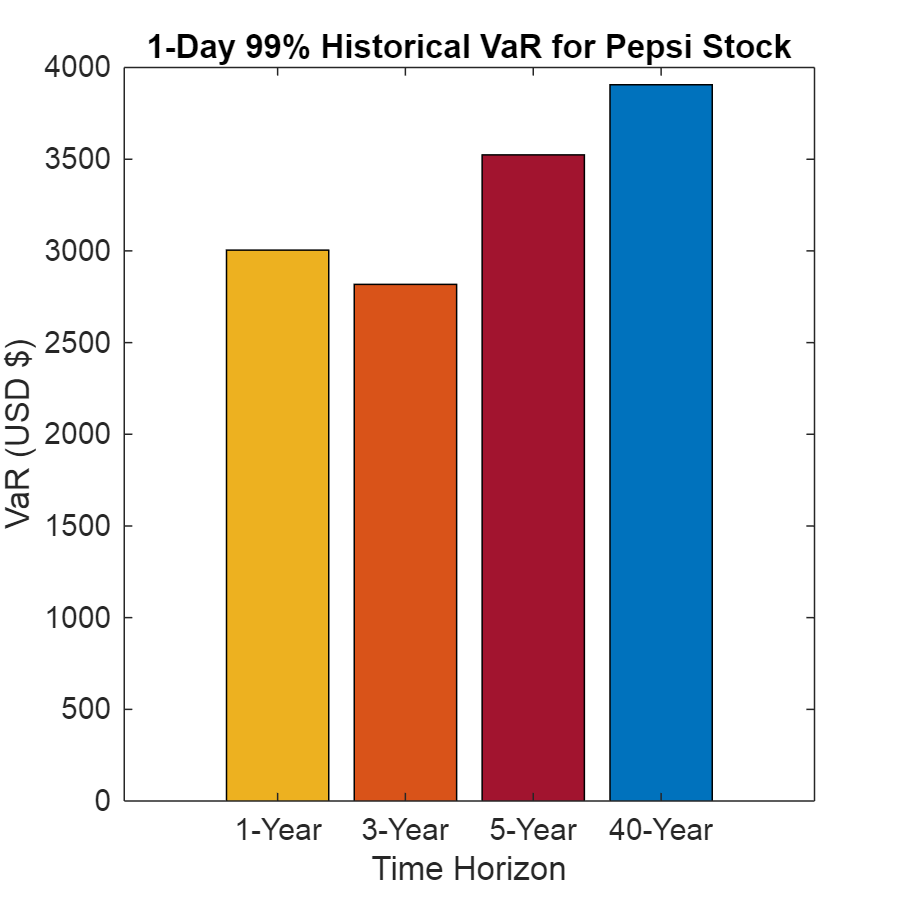
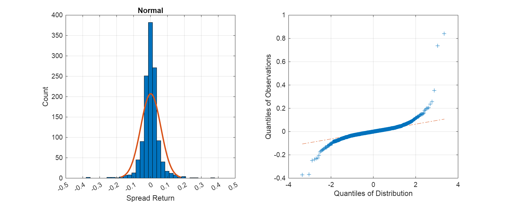

# Class 4 Homework \- Xinyi (Cynthia) Shen

Student Number: 1005778428

# Problem

Calculate 1 day 99% VaR for Pepsi

-  using the historical method 
-  one parametric method of your choosing 
-  using 40 years of data from Yahoo! Finance 
-  Assume you have USD\$100,000 in Pepsi stock 

How do your numbers compare to what we did in class? If worse, why?

## Download Coke and Pepsi Stock Data
```matlab
% Use Python's yfinance to download PEP historical stock data for the last 40 years
PEP_data = py.yfinance.download('PEP', pyargs('start', '1984-10-02', 'end', '2024-10-02', 'interval', '1d'));
```

```matlabTextOutput
[*********************100%***********************]  1 of 1 completed
```

```matlab
% Convert dataframe to table
TTPEP = table(PEP_data);

% Clean column names and remove unecessary variables, for now
TTPEP = renamevars(TTPEP, "Adj Close", "PEP");
TTPEP = removevars(TTPEP, ["Open","High","Low","Close","Volume"]);

% Key Time Series
t = datetime(TTPEP.Date);
pep = TTPEP.PEP;

% Define the change and % change in KO and PEP
dPEP = diff(pep);
rPEP = diff(pep) ./pep(1:end-1);

% Assume some portfolio value
portfolio_value = 100000; %  !!!EQ_1!!!!!!EQ_2!!!!!!EQ_3!!! 100k in 40-year Pepsi stock data is: USD  !!!EQ_4!!! 100k in 40-year Pepsi stock data is: USD  !!!EQ_5!!! 100k in 1-year Pepsi stock data is: USD  !!!EQ_6!!! 100k in 1-year Pepsi stock data is: USD  !!!EQ_7!!! 100k in 3-year Pepsi stock data is: USD  !!!EQ_8!!! 100k in 3-year Pepsi stock data is: USD  !!!EQ_9!!! 100k in 5-year Pepsi stock data is: USD  !!!EQ_10!!! 100k in 5-year Pepsi stock data is: USD  !!!EQ_11!!! )');
title('1-Day 99% Historical VaR for Pepsi Stock');
```


### Observation

The 1-day 99% historical VaR for USD\$100,000 in **40-year** Pepsi stock data is **higher** than the 1-day 99% historical VaRs for USD\$100k in 1-year Pepsi stock data is: USD $00k in 40-year Pepsi stock data is: USD $ %.2f\n', nVaR_PEP_40);
```

```matlabTextOutput
1-Day 99% Normal VaR for USD  !!!EQ_13!!! 3426.36
```
### Observations

Based on the **Normal VaR** method, I calculated the 1-Day 99% Normal VaR for a USD \$100k portfolio of Pepsi stock using 40 years of data to be USD \$3426.48.


For the 40-year data, the **Historical VaR** (USD \$3906.27) is **higher** than the **Normal VaR** (USD \$3426.48). This suggests that the **normal distribution** underestimates the tail risk when compared to the historical distribution of returns.


The **Historical VaR** for shorter periods (1-year, 3-year, 5-year) tends to be lower than the 40-year VaR. This makes sense because shorter time horizons might not capture as many extreme market events as a longer 40-year dataset, which includes more volatile periods.


Notably, the **5-year Historical VaR (USD \$3526.58)** is close to the **40-year Normal VaR (USD \$3426.48)**, indicating that for shorter periods, the normal distribution might provide a reasonable approximation of risk.

### What We Did in Class
```matlab
KO_data_5 = py.yfinance.download('KO', pyargs('period', '5y', 'interval', '1d'));
```

```matlabTextOutput
[*********************100%***********************]  1 of 1 completed
```

```matlab
PEP_data_5 = py.yfinance.download('PEP', pyargs('period', '5y', 'interval', '1d'));
```

```matlabTextOutput
[*********************100%***********************]  1 of 1 completed
```

```matlab
TTKO_5 = table(KO_data_5);
TTPEP_5 = table(PEP_data_5);

TTKO_5 = renamevars(TTKO_5, "Adj Close", "KO");
TTPEP_5 = renamevars(TTPEP_5, "Adj Close", "PEP");

ko_5 = TTKO_5.KO;
pep_5 = TTPEP_5.PEP;
spread_5 = pep_5 - 2.25 * ko_5;

dSPRD = diff(spread_5);
rSPRD = diff(spread_5) ./spread_5(1:end-1);

pdNORMAL = fitdist(1+rSPRD, 'Normal')
```

```matlabTextOutput
pdNORMAL = 
  NormalDistribution

  Normal distribution
       mu =   1.00171   [0.998425, 1.00499]
    sigma = 0.0593142   [0.0570829, 0.0617285]

```

```matlab
% Calculate 1-day 99% Normal VaR for Spread
nRaR_SPRD_40 = pdNORMAL.mu - z_99 * pdNORMAL.sigma;
nVaR_SPRD_40 = - portfolio_value * nRaR_SPRD_40;

fprintf('1-Day 99%% Normal VaR for rSPRD: %.4f\n', nVaR_SPRD_40);
```

```matlabTextOutput
1-Day 99% Normal VaR for rSPRD: -86372.1897
```

```matlab
figure()
set(gcf, 'Position', [0 0 1000 400])
 
subplot(1,2,1)
histfit(rSPRD,50,'normal')
set(gca,'XTick',-0.5:0.10:0.5)
xlim([-0.50 +0.50])
title('Normal')
ylabel('Count')
xlabel('Spread Return')
grid on
 
subplot(1,2,2)
qqplot(rSPRD, makedist("Normal"))
title('')
ylabel('Quantiles of Observations')
xlabel('Quantiles of Distribution')
box on
grid on
```



It is hard to compare what we did in class since we implemented the parametric methods to calculate spread VaR in class while we only need to implement the parametric method to compute Pepsi stock VaR in this homework.

