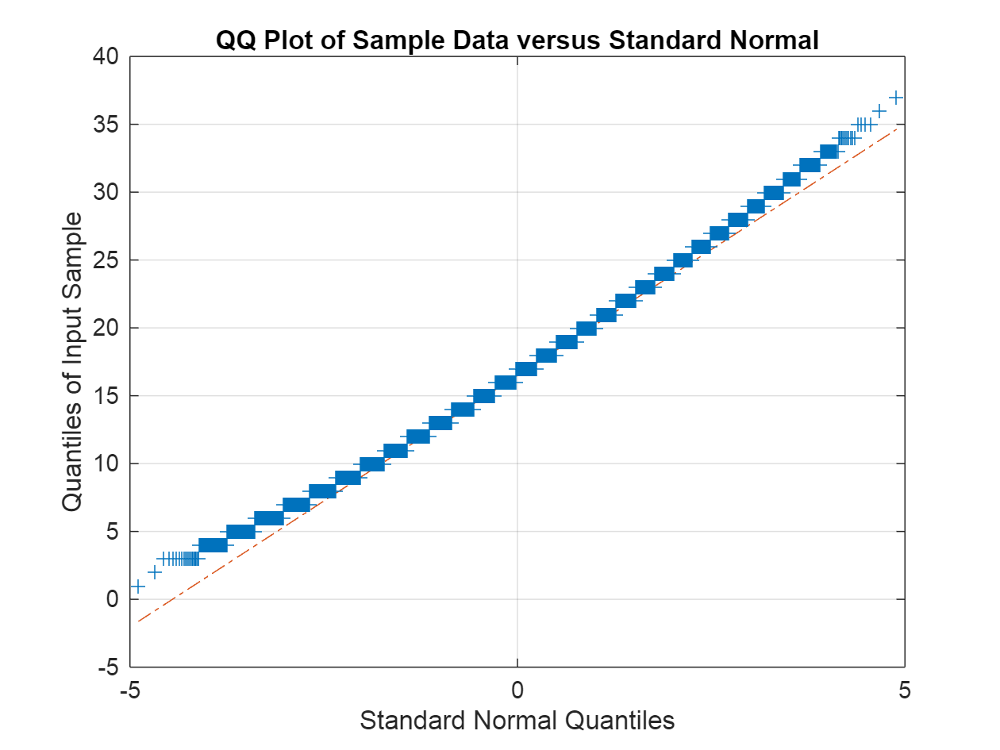

# Class 1 Problem 1 Loaded Die
# Problem 1

We are given a six sided die and told that after rolling it 100 times we got the following outcomes:


Roll(1) = 25, Roll(2) = 15, Roll(3) = 15, Roll(4) = 15, Roll(5) = 15, Roll(6) = 15.


How do we determine if it is loaded or not?

# Naive Approach

A fair die has an equity probability of rolling either side. It is a die so rolling it and setting on a face represents a discrete random variable. Since each side is equi\-probable, it can best be describes by a uniform discrete distribution with f(x, x={1,2,3,4,5,6}) = 1/6

1.  Focus our question only the side "1"
2. Let's generate 1,000,000 trials of rolling a fair die 100 times
3. Generate the empirical distribution of 1's
4. Determine the odds of generating 25 1's in 100 rolls
## Step 0. The Die Assumptions
```matlab
pFair = 1/6;

RollNames = [1 2 3 4 5 6];
RollObs = [25 15 15 15 15 15];

% Make sure the odds add up to 100%
sum(RollObs)
```

```matlabTextOutput
ans = 100
```
## Step 1. 1,000,000 Trials of Rolling a Fair Die 100 Times
```matlab
NTrials = 1000000;
NRolls = 100;
```
### a. Understanding the Numerical Process and Simulating a Fair Random Die
```matlab
% Always start with a uniform distribution
U = rand(NRolls, 1)
```

```matlabTextOutput
U = 100x1
    0.9673
    0.3144
    0.6742
    0.7410
    0.2131
    0.7943
    0.1225
    0.5531
    0.1864
    0.2485

```

```matlab
% Create CDF to model the inverse
FDieInverse = cumsum([pFair pFair pFair pFair pFair pFair])
```

```matlabTextOutput
FDieInverse = 1x6
    0.1667    0.3333    0.5000    0.6667    0.8333    1.0000

```

```matlab
% Cleverly create the loaded die using the inverse (many ways to do this)
TrialRoll = 1 + sum((FDieInverse - U < 0), 2)
```

```matlabTextOutput
TrialRoll = 100x1
     6
     2
     5
     5
     2
     5
     1
     4
     2
     2

```

```matlab
% Find the total rolls for each fase ... you can do this sort, not a slow for loop
I = find(diff(sort(TrialRoll)) ~= 0); I
```

```matlabTextOutput
I = 5x1
    18
    32
    43
    64
    82

```
### b. Now Do the Experiment 1M Times
```matlab
% Need a variable to record trails of the experiment
ExperimentRollObs = NaN(NTrials, length(RollNames));

tic
for i = 1:NTrials

    U = rand(NRolls, 1);
    TrialRoll = 1 + sum((FDieInverse - U < 0), 2);
    ExperimentRollObs(i, :) = diff([0; find(diff(sort(TrialRoll)) ~= 0); 100]');

end
toc
```

```matlabTextOutput
Elapsed time is 5.126808 seconds.
```

```matlab
% Each experiment is a row showing the totals of each face rolled
ExperimentRollObs
```

```matlabTextOutput
ExperimentRollObs = 1000000x6
    10    19    20    15    22    14
    19    14    13    17    18    19
    18    19    12    13    22    16
    15    16    16    11    24    18
    17    21     9    24    16    13
    18    18    19    11    16    18
    13    21    18    17    16    15
    20    15    24    13    15    13
    13    17    16    23    13    18
     9    21    17    17    18    18

```
## Step 2: Determine the Empirical Distribution of 1's
```matlab
% Our focus is on the ones
ExpOnes = ExperimentRollObs(:, 1)
```

```matlabTextOutput
ExpOnes = 1000000x1
    10
    19
    18
    15
    17
    18
    13
    20
    13
     9

```

```matlab
% Histogram of "1's": we will use Sturge's Rule as an example of bin width calculation
NBinSturge = floor(1 + 3.22 * log10(NTrials))
```

```matlabTextOutput
NBinSturge = 20
```

```matlab
figure()
histogram(ExpOnes, NBinSturge)

grid on
xlabel('Number of Occurences of 1')
ylabel('Count of Occurences')
title(["Histogram of 1's", "in 100 Die Rolls"])
```


```matlab
% Empirical Cumulative Distribution of "1's"
figure()
ecdf(ExperimentRollObs(:,1)) % all rows
grid on
xlabel('Number of Occurences of 1')
title(["Empirical Distribution of 1's", "in 100 Die Rolls"])
```


```matlab
% QQ-Plot
figure()
qqplot(ExpOnes)
grid on
box on
```



```matlab
% Boxplot
figure()
boxplot(ExperimentRollObs, "Notch", "on")
grid on
xlabel("Die Face")
ylabel("Count of 1's")
title(["Boxplot of all Die Faces Rolled", "in 100 Die Rolls"])
```


## Step 3. Infer the statistics of Fairness and Compare Against Die
```matlab
% So let's determine the percentile of a loaded number
SortedExpOnes = sort(ExpOnes)
```

```matlabTextOutput
SortedExpOnes = 1000000x1
     1
     2
     3
     3
     3
     3
     3
     3
     3
     3

```

```matlab
I = find(SortedExpOnes >= RollObs(1), 1, "first")
```

```matlabTextOutput
I = 978181
```

```matlab
MyOdds = 1 - I/NTrials; MyOdds
```

```matlabTextOutput
MyOdds = 0.0218
```

The odds of getting 25 ones in a 100 tosses of the die is about 2%. So our naive test of this die would suggest that the die is biased, but it may not cross some 99.9% threshold style argument.


However, you might argue that our test wasn't really representative. Maybe the test should be any face greater than 25, there is nothing special about the ones. So we might try the following:

```matlab
I2 = find(ExperimentRollObs(:, 2) >= RollObs(1));
I3 = find(ExperimentRollObs(:, 3) >= RollObs(1));
I4 = find(ExperimentRollObs(:, 4) >= RollObs(1));
I5 = find(ExperimentRollObs(:, 5) >= RollObs(1));
I6 = find(ExperimentRollObs(:, 6) >= RollObs(1));

IUnion = unique([I2; I3; I4; I5; I6]);
MyOdds = length(IUnion) / NTrials
```

```matlabTextOutput
MyOdds = 0.1076
```

So a more relaxed test on any die face being more than 25 in any given 100 rolls is actually about 10%. So maybe the die isn't as biased as it may look from one set of 100 rolls.

