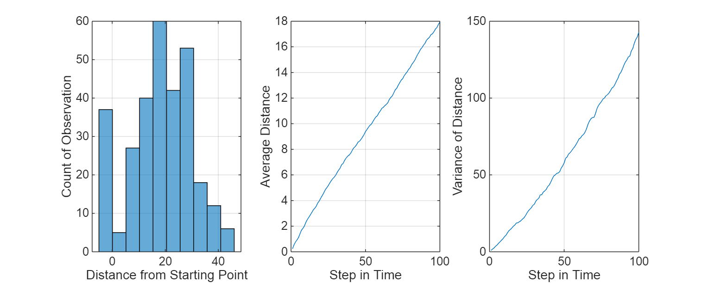

# Class 2 Problem 1 Random Walk
# Problem 1

Consider a random walk with a probability 0.6 being +1 and 0.4 being \-1. The walk starts from 0.


a. Walk 100 steps, what is the expectation at the end?


b. Set a barrier \-5. Once the random walk hits, it stops there. What is the expectation for the walk after 100 steps?


c. Set up barriers at +10 before \-10? What is the expectation for the walk after 100 steps?


d. Explore a double absorbing barrier

## Random Walk Assumptions
```matlab
% Experiment Parameters
TWalk = 100; % walk 100 steps
NTrials = 300; % number of trials of the random walk

% Walk starting point
Xo = 0;

% Probability of being +1 and -1
pu = 0.6;
pd = 1 - pu;
```
## Simulate Random Walks
```matlab
% Start with the uniform random distribution
U = rand(TWalk, NTrials);

% Use the inverse transform method to create the "loaded coin"
dX = zeros(TWalk, NTrials);
dX(U <= pd) = -1;
dX(U > pd) = +1;
X = Xo + cumsum(dX);
```
## Plot the Paths
```matlab
figure()
plot(X)
grid on
title("Outcome of a Biased Random Walk")
xlabel("Steps in Time")
ylabel("Distance From Starting Point")
```


## Question A: End Expectations
```matlab
figure()

set(gcf, "position", [1 1 1000 400])

% Histogram of the Terminal Distance
subplot(1, 3, 1)
histogram(X(end, :), 10)
grid on
xlabel("Distance From Starting Point")
ylabel("Count of Observations")

% Plot of the average distance in time
subplot(1, 3, 2)
plot(mean(X, 2))
grid on
xlabel("Step in Time")
ylabel("Average Distance")
ylim([-50 50])

% Plot of the variance in time
subplot(1, 3, 3)
plot(var(X, 0, 2))
grid on
xlabel("Step in Time")
ylabel("Variance of Distance")
```


```matlab
% Using boxplots to visualize the distribution over time
figure()
set(gcf, "position", [1 1 1000 400])

boxplot(X([1, 10:10:100], :)', "Notch", "on") % ': transpose
title("Visualizing the Distribution over Time Using Boxplots")
xlabel("Steps in Time")
ylabel("Distance from Starting Point")

grid on
set(gca, "XTickLabels", [1, 10:10:100])
```


## Question B: The Absorbing Barrier and It's Expectation
```matlab
% The logic of absorbing barrier
Y = X;

XBarrier = -5;

for i = 1:NTrials

    IBarrier = find(X(:, i) <= XBarrier, 1, 'first');

    if ~isempty(IBarrier)

        Y(1:IBarrier, i) = X(1:IBarrier, i);
        Y(IBarrier:TWalk, i) = X(IBarrier, i);

    else

        Y(:, i) = X(:, i);

    end
 
end

figure()
set(gcf, "position", [1 1 1000 400])
subplot(1, 3, 1)
NSturges = ceil(log2(NTrials) + 1);
histogram(Y(end, :), NSturges)

grid on
xlabel("Distance from Starting Point")
ylabel("Count of Observation")

subplot(1, 3, 2)

plot(mean(Y, 2))

grid on
xlabel("Step in Time")
ylabel("Average Distance")

subplot(1, 3, 3)
plot(var(Y, 0, 2))
grid on
xlabel("Step in Time")
ylabel("Variance of Distance")
```



```matlab
figure()
set(gcf, "position", [1 1 1000 400])

boxplot(Y([1, 10:10:100], :)', "Notch", "on")
xlabel("Steps in Time")
ylabel("Distance from Starting Point")

grid on
set(gca, "XTickLabels", [1, 10:10:100])
```


The expectation for the walk after 100 steps is

```matlab
mean(Y(100, :))
```

```matlabTextOutput
ans = 17.9500
```

```matlab
median(Y(100, :))
```

```matlabTextOutput
ans = 18
```
## Question C: Reaching One Point Before Another
```matlab
a = 10;
b = -10;

ProbABeforeB = zeros(NTrials, 1);

for i = 1:NTrials

    IA = find(X(:, i) >= a, 1, 'first');
    IB = find(X(:, i) <= b, 1, 'first');

    if ~isempty(IA) & isempty(IB)

        ProbABeforeB(i) = 1;

    elseif ~isempty(IA) & ~isempty(IB)

        if IA < IB

            ProbABeforeB(i) = 1;

        end

    end

end
```

The expectation for the walk after 100 steps is

```matlab
sum(ProbABeforeB)/length(ProbABeforeB)
```

```matlabTextOutput
ans = 0.9333
```
## Question D: Double Absorbing Barrier
```matlab
Z = X;

for i = 1:NTrials

    IA = find(X(:, i) >= a, 1, "first");
    IB = find(X(:, i) <= b, 1, "first");

    if ~isempty(IA) & isempty(IB)

        Z(1: IA, i) = X(1:IA, i);
        Z(IA:TWalk, i) = X(IA, i);

    elseif isempty(IA) & ~isempty(IB)

        if IA < IB

            Z(1:IA, i) = X(i:IA, i);
            Z(IA:TWalk, i) = X(IA, i);
            
        else

            Z(1:IB, i) = X(1:IB, i);
            Z(IB:TWalk, i) = X(IB, i);

        end

    end

end

figure()
set(gcf, "position", [1 1 1000 400])

boxplot(Z([1, 10:10:100], :)', "notch", "on")
title("Visualizing the Double Absorbing Barrier")
xlabel("Steps in Time")
ylabel("Distance from Starting Point")

grid on
set(gca, "XTickLabels", [1, 10:10:100])
```


