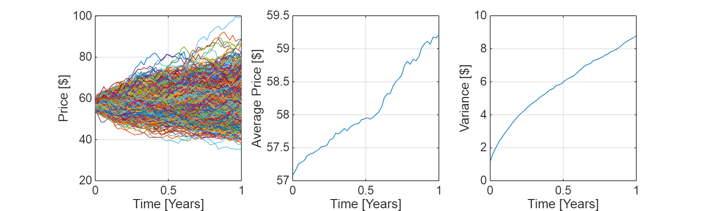
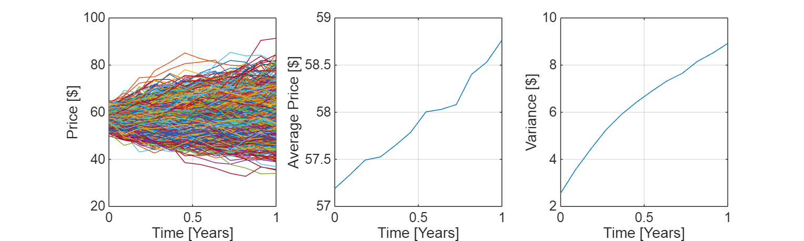
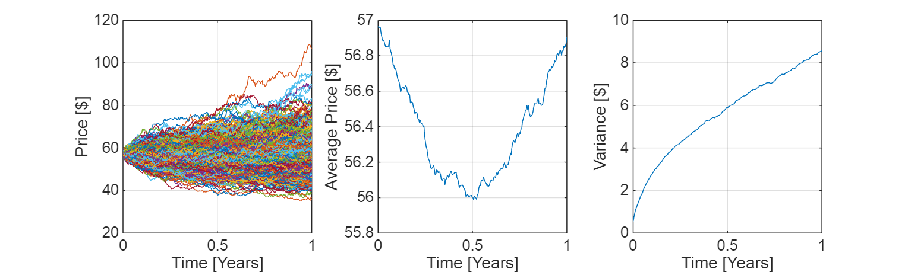

# Class 2 Problem 2 Stock Price Simulator
# Problem 2

Using a Geometric Brownian Motion, simulate the Coke and Pepsi stock prices on a yearly, monthly, and daily basis.

-  KO: Coca Cola closed on Sep 24th 2023 at USD \$57. Options suggest that the forward volatility is 15% per year. 
-  KO: Has a dividend yield of 3.19% per year 
-  PEP: Pepsi closed at \$174 on Sep 24th 2023. Options suggset that the forward volatility is 20% per year. 
-  PEP: Has a dividend yield of 2.76%. 
## 2.1 KO
### 2.1.0 Set Parameters
```matlab
So = 57; % stock price

mu = 0.0319; % dividend yield [% in a year]
sigma = 0.15; % volatility [%]

T = 1; % maturity [year]
NTrials = 1000; % steps
```
### 2.1.1 KO Daily Basis
```matlab
% Daily Experiment
NSteps = 252;
t = linspace(0, T, NSteps)';
dt = T/NSteps;

% Generate our random variable
U = rand(NSteps, NTrials);
dW = norminv(U);

% Simulate the return on the SDE
r = mu * dt * ones(size(U)) + sigma * sqrt(dt) * dW;
dS = r;

% Integrate as a Geometric Brownian Motion
S = So*cumprod(1 + dS);

% Integrate as an Arithmetic Brownian Motion
% S = So * cumsum(dS)

figure()
set(gcf, "position", [1, 1, 1000, 300])

subplot(1, 3, 1)
plot(t, S)
grid on
xlabel("Time [Years]");
ylabel("Price [ !!!EQ_1!!! ]");

subplot(1, 3, 3)
plot(t, std(S, 0, 2))
grid on
xlabel("Time [Years]");
ylabel("Variance [ !!!EQ_2!!! ]");

subplot(1, 3, 2)
plot(t, mean(S, 2))
grid on
xlabel("Time [Years]");
ylabel("Average Price [ !!!EQ_3!!! ]");
```


### 2.1.3 KO Monthly Basis
```matlab
% Monthly Experiment
NSteps = 12;
t = linspace(0, T, NSteps)';
dt = T/NSteps;

% Generate our random variable
U = rand(NSteps, NTrials);
dW = norminv(U);

% Simulate the return on the SDE
r = mu * dt * ones(size(U)) + sigma * sqrt(dt) * dW;
dS = r;

% Integrate as a Geometric Brownian Motion
S = So*cumprod(1 + dS);

% Integrate as an Arithmetic Brownian Motion
% S = So * cumsum(dS)

figure()
set(gcf, "position", [1, 1, 1000, 300])

subplot(1, 3, 1)
plot(t, S)
grid on
xlabel("Time [Years]");
ylabel("Price [ !!!EQ_1!!! ]");

subplot(1, 3, 3)
plot(t, std(S, 0, 2))
grid on
xlabel("Time [Years]");
ylabel("Variance [ !!!EQ_5!!! ]')
```


### 2.1.4 Path of Interest
```matlab
% Daily Experiment
NSteps = 252;
muPath = mu * [-ones(NSteps/2, 1); ones(NSteps/2, 1)];
t = linspace(0, T, NSteps)';
dt = T/NSteps;

% Generate our random variable
U = rand(NSteps, NTrials);
dW = norminv(U);

% Simulate the return on the SDE
r = repmat(muPath, 1, NTrials) .* ones(size(U)) * dt + sigma * sqrt(dt) * dW;
% .*: element-wise multiplication for matrix
% r = mu * dt * ones(size(U)) + sigma * sqrt(dt) * dW;
dS = r;

% Integrate as a Geometric Brownian Motion
S = So * cumprod(1 + dS);

% Integrate as an Arithmetic Brownian Motion
% S = So * cumsum(dS)

figure()
set(gcf, "position", [1, 1, 1000, 300])

subplot(1, 3, 1)
plot(t, S)
grid on
xlabel("Time [Years]");
ylabel("Price [ !!!EQ_1!!! ]");

subplot(1, 3, 3)
plot(t, std(S, 0, 2))
grid on
xlabel("Time [Years]");
ylabel("Variance [$]");
```


