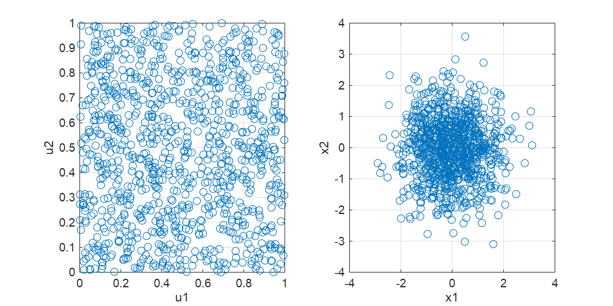
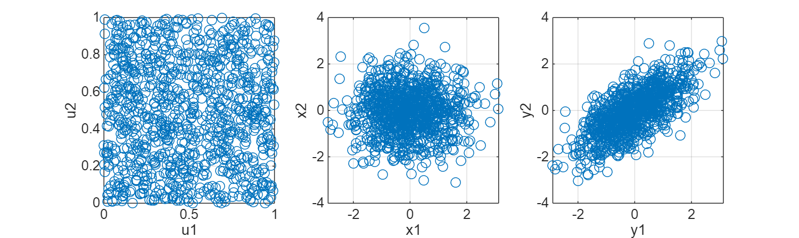
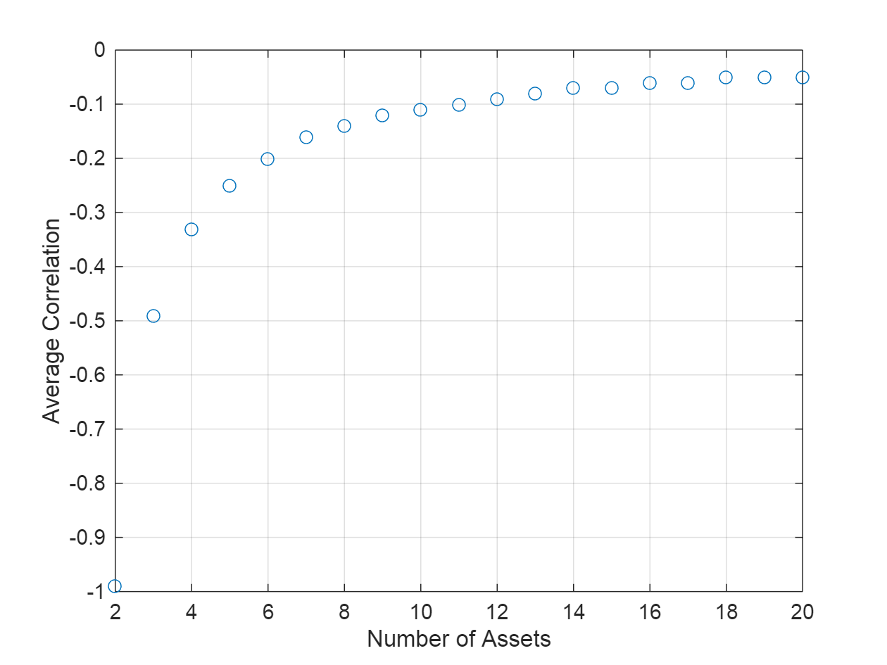
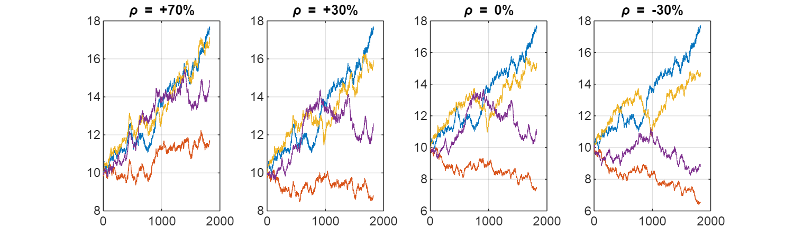
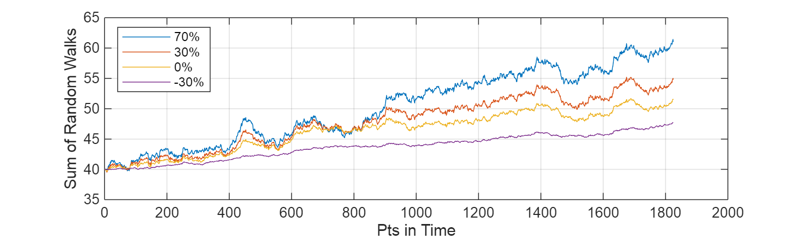

# Class 3 Problem 1 Cholesky Example
```matlab
% Let's generate 2 random normal variables

% Generates a 1000*1 vector of random numbers drawn from a uniform distribution in the interval [0, 1)
u1 = rand(1000,1);
u2 = rand(1000,1);
 
% Computes the inverse of CDF for a normal distribution (quantile function):
% Given a probability, returns corresponding value in normal distribution
x1 = norminv(u1); 
x2 = norminv(u2);
 
figure()
set(gcf,'Position',[0, 0, 1000, 500])
 
subplot(1,2,1)
plot(u1,u2,'o')
xlabel('u1')
ylabel('u2')
grid on
 
subplot(1,2,2)
plot(x1,x2,'o')
xlabel('x1')
ylabel('x2')
grid on
```



```matlab
% Now let's create a correlation matrix that we want to transform to

% Correlation Coefficient
rho = 0.7;

% Correlation Matrix (symmetric and positive definite, requirement for Cholesky decomposition)
C = [1, rho;
     rho, 1];

% Cholesky Decomposition
L_Upp = chol(C, 'upper'); % Upper triangular Cholesky factor
L_Low = chol(C, 'lower'); % Lower triangular Cholesky factor
L = L_Upp;

y = [x1, x2] * L; % correlated random variables

y1 = y(:,1);
y2 = y(:,2);

figure()
set(gcf,'Position',[0, 0, 1000, 300])
 
subplot(1,3,1)
plot(u1,u2,'o')
xlabel('u1')
ylabel('u2')
grid on
 
subplot(1,3,2)
plot(x1,x2,'o')
xlabel('x1')
ylabel('x2')
grid on
 
subplot(1,3,3)
plot(y1,y2,'o')
xlabel('y1')
ylabel('y2')
grid on
```



```matlab
% Test the correlation
corrcoef(y) % Computes correlation matrix of y
```

```matlabTextOutput
ans = 2x2
1.0000    0.7028
    0.7028    1.0000

```

```matlab
% Suppose you have 2 assets that are -70% correlated.
% What is the smallest correlation that you could theoretically find to diversify this portfolio?
NAssets = 3;
rho12 = -0.7;
rho3 = 0.35;

CTest = eye(NAssets) + triu(rho12 * ones(NAssets), 1) + tril(rho12 * ones(NAssets), -1);
CTest(1,3) = rho3; CTest(3,1) = rho3;
CTest(2,3) = rho3; CTest(3,2) = rho3;
 
CTest
```

```matlabTextOutput
CTest = 3x3
1.0000   -0.7000    0.3500
   -0.7000    1.0000    0.3500
    0.3500    0.3500    1.0000

```

```matlab
LTest = chol(CTest,'upper')
```

```matlabTextOutput
LTest = 3x3
1.0000   -0.7000    0.3500
         0    0.7141    0.8332
         0         0    0.4282

```

```matlab
% What is the most negative correlation that you can create with multiple assets?
NAssets = 2:20;
minAvgCorrelation = zeros(size(NAssets));
 
for i = 1:length(NAssets)
    for rho = -1:0.01:1 % from -1 to 1 in steps of 0.01
        CTest = eye(NAssets(i)) + ... % identity matrix
                triu(rho * ones(NAssets(i)), 1) + ... % upper triangular
                tril(rho * ones(NAssets(i)), -1); % lower triangular
        try
            LTest = chol(CTest,'upper'); % attempt Cholesky decomposition
            minAvgCorrelation(i) = rho; % store current valid correlation
            break % exit the loop once decomposition is successful
        catch
            % if matrix is not positive definite, move to next value of rho
        end
    end
end
 
figure()
 
plot(NAssets, minAvgCorrelation, 'o')
grid on
xlabel('Number of Assets')
ylabel('Average Correlation')
```



```matlab
% What does 4 Assets look like that are -30%, 0%, +30%, and +70% correlated look like as random walks?
NAssets = 4; % number of assets
NSteps = 5*365; % number of steps (5 years of daily data)
T = 1; % total time (1 year for simplicity)
dt = T/NSteps; % time step size
U = rand(NSteps,NAssets); % random uniform variables

% For the sake of this exercise, we'll assume each has the same volatility
sigma = 0.20; % volatility 20% per year
mu = 0.10; % expected return 10% per year
So = 10; % initial price of assets
Z = norminv(U); % convert uniform variables to normal variables

% Case of avg corrrelation +70%
rho = 0.70;
C70 = eye(NAssets) + triu(rho * ones(NAssets), 1) + tril(rho * ones(NAssets), -1);
L70 = chol(C70,'upper');
Z70 = Z * L70;
X70 = So * cumprod(1 + mu*dt + sigma * sqrt(dt) * Z70); % geometric brownian motion

% Case of avg corrrelation +30%
rho = 0.30;
C30 = eye(NAssets) + triu(rho * ones(NAssets), 1) + tril(rho * ones(NAssets), -1);
L30 = chol(C30,'upper');
Z30 = Z * L30;
X30 = So * cumprod(1 + mu*dt + sigma * sqrt(dt) * Z30);

% Case of avg corrrelation 0%
rho = 0.0;
C0 = eye(NAssets) + triu(rho * ones(NAssets), 1) + tril(rho * ones(NAssets), -1);
L0 = chol(C0,'upper');
Z0 = Z * L0;
X0 = So * cumprod(1 + mu*dt + sigma * sqrt(dt) * Z0);

% Case of avg corrrelation -30%
rho = -0.30;
Cm30 = eye(NAssets) + triu(rho * ones(NAssets), 1) + tril(rho * ones(NAssets), -1);
Lm30 = chol(Cm30,'upper');
Zm30 = Z * Lm30;
Xm30 = So * cumprod(1 + mu*dt + sigma * sqrt(dt) * Zm30);

figure()
set(gcf,'Position',[0, 0, 1000, 300])

subplot(1,4,1)
plot(X70)
title('\rho = +70%')
grid on

subplot(1,4,2)
plot(X30)
title('\rho = +30%')
grid on

subplot(1,4,3)
plot(X0)
title('\rho = 0%')
grid on

subplot(1,4,4)
plot(Xm30)
title('\rho = -30%')
grid on
```



```matlab
% Portfolio looks like this...
figure()
set(gcf,'Position',[0, 0, 1000, 300])

plot(sum(X70,2)) % sums the values across the columns for each row (i.e., at each time step, it sums the values of all assets)
hold on
plot(sum(X30,2))
plot(sum(X0,2))
plot(sum(Xm30,2))

hold off

grid on

xlabel('Pts in Time')
ylabel('Sum of Random Walks')
legend({'70%','30%','0%','-30%'}, "location", "northwest")
```


