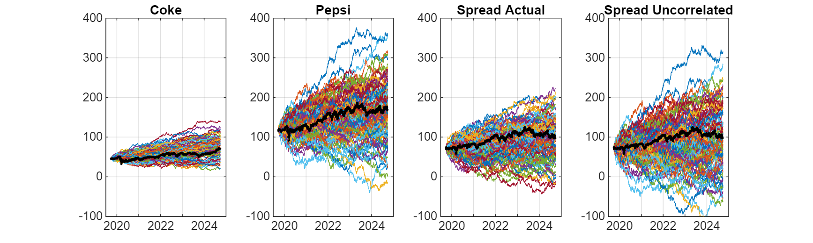

# Class 3 Problem 2 Coke Pepsi Challenge
# Problem
1.  Simulate a Coke\-Pepsi portfolio using correlation.
2. Simulate a multi\-asset portfolio.
3. What is the minimum average correlation across a 3 assets? 4 assets?
4. Simulate Coke only using an ARIMA style process.
5. Model Coke\-Pepsi as a mean reverting process.
## Download and Preprocess Data
```matlab
% Use Python's yfinance to download KO and PEP historical data for the last 10 years
KO_data = py.yfinance.download('KO', pyargs('period', '5y', 'interval', '1d'));
```

```matlabTextOutput
[*********************100%***********************]  1 of 1 completed
```

```matlab
PEP_data = py.yfinance.download('PEP', pyargs('period', '5y', 'interval', '1d'));
```

```matlabTextOutput
[*********************100%***********************]  1 of 1 completed
```

```matlab
% Convert dataframe to table
TTKO = table(KO_data);
TTPEP = table(PEP_data);

% Clean column names and remove unecessary variables, for now
TTKO = renamevars(TTKO, "Adj Close", "KO");
TTKO = removevars(TTKO,["Date", "Open","High","Low","Close","Volume"]);
TTPEP = renamevars(TTPEP, "Adj Close", "PEP");
TTPEP = removevars(TTPEP,["Open","High","Low","Close","Volume"]);

% Combine into one timetable
TT = [TTPEP TTKO]
```
| |Date|PEP|KO|
|:--:|:--:|:--:|:--:|
|1|30-Sep-2019|118.9209|46.6290|
|2|01-Oct-2019|119.1551|46.8089|
|3|02-Oct-2019|116.1800|45.4642|
|4|03-Oct-2019|119.6409|46.1151|
|5|04-Oct-2019|121.6793|46.7147|
|6|07-Oct-2019|119.9965|46.1408|
|7|08-Oct-2019|119.0424|45.8924|
|8|09-Oct-2019|119.5715|46.1065|
|9|10-Oct-2019|119.6062|45.9609|
|10|11-Oct-2019|119.3893|45.6526|
|11|14-Oct-2019|119.2245|45.6526|
|12|15-Oct-2019|118.2531|45.8325|
|13|16-Oct-2019|118.3311|45.8153|
|14|17-Oct-2019|118.7995|46.0723|

## Plot Coke, Pepsi, and Coke \- Pepsi Spread
```matlab
% Create a new table with Coke, Pepsi, and Coke-Pepsi
t = datetime(TT.Date);

%spread = TTPEP.PEP - 2.75*TTKO.KO;
spread = TTPEP.PEP - TTKO.KO;
ko = TTKO.KO;
pep = TTPEP.PEP;
 
figure()
set(gcf, 'Position', [0 0 1000 1000])
 
subplot(3,1,1)
plot(t,spread)
xtickformat('yyyy')
ylabel('PEP - KO [ $]')grid on subplot(3,1,2)plot(t,ko)xtickformat('yyyy')ylabel('KO [$ ]')
grid on
 
subplot(3,1,3)
plot(t,pep)
xtickformat('yyyy')
ylabel('PEP [ $]')grid on```
\begin{center}\end{center}\matlabheadingtwo{Check Normality of Daily Changes in Coke, Pepsi, and Coke - Pepsi Spread}```matlab% Is it normal?
% diff: difference between consecutive elementsdSpread = diff(spread); % first-order difference of spreadrSpread = diff(spread) ./ spread(1:end-1); % percentage returns for spreaddKO = diff(ko); % first order difference of korKO = diff(ko) ./ ko(1:end-1); % percentage returns for kodPEP = diff(pep); % first order difference of peprPEP = diff(pep) ./ pep(1:end-1); % percentage returns for peppd = makedist("Normal"); % standard normal distribution object
figure()set(gcf, 'Position', [0 0 1000 1000])
subplot(3,2,1)histogram(dSpread,50);grid on;title('Histogram of PEP - KO')xlabel('Dollar Spread [$ ]')
subplot(3,2,2)
qqplot(dSpread,pd); % compare spread against normal distribution
grid on

subplot(3,2,3)
histogram(dKO,50);
grid on;
title('Histogram of Returns of KO')
xlabel('Daily Change [ $]')subplot(3,2,4)qqplot(dKO,pd); % compare dko against normal distributiongrid on
subplot(3,2,5)histogram(dPEP,50);grid on;title('Histogram of Returns of PEP')xlabel('Daily Change [$ ]')
subplot(3,2,6)
qqplot(dPEP,pd); % compare dpep against normal distribution
grid on
```


## Monte Carlo Simulations for Random Walk using GBM

By simulating paths using the cumulative sum, the formula here is a simplified version of GBM:


 $X_{t+1} =X_t +\mu +\sigma Z_t$ where $Z_t \sim \mathcal{N}(0,1)$ 

```matlab
% Some Models
NTrials = 100;
T = 1;
NSteps = length(t);
dt = T/NSteps;

% Model KO
mu = mean(dKO); % mean of dko
sigma = std(dKO); % standard deviation of dko
U = rand(NSteps, NTrials); % uniformly distributed random numbers between 0 and 1
Z = norminv(U); % normally distributed random variables
Xo = ko(1); % initial value of ko
Xko = Xo + cumsum(mu + sigma * Z); % simulate paths for the stock price using a random walk

% Model PEP
mu = mean(dPEP);
sigma = std(dPEP);
U = rand(NSteps, NTrials);
Z = norminv(U);
Xo = pep(1);
Xpep = Xo + cumsum(mu + sigma * Z);

% Model The Spread PEP - KO ... arithmetic
mu = mean(dSpread);
sigma = std(dSpread);
U = rand(NSteps, NTrials);
Z = norminv(U);
Xo = spread(1);
X = Xo + cumsum(mu + sigma * Z);

figure
set(gcf, 'Position', [0 0 1000 300])

% Coke
subplot(1,4,1)
plot(t,Xko) % simulate
title('Coke')
xtickformat('yyyy')
grid on
hold on
plot(t,ko,'ko','MarkerSize',1) % actual
hold off
ylim([-100 400])

% Pepsi
subplot(1,4,2)
plot(t,Xpep) % simulate
title('Pepsi')
xtickformat('yyyy')
grid on
hold on
plot(t,pep,'ko','MarkerSize',1) % actual
hold off
ylim([-100 400])

% Spread Actual
subplot(1,4,3)
plot(t,X) % simulate
title('Spread Actual')
xtickformat('yyyy')
grid on
hold on
plot(t,spread,'ko','MarkerSize',1) % actual
hold off
ylim([-100 400])

% Spread Uncorrelated
subplot(1,4,4)
plot(t, Xpep - Xko) % simulate
title('Spread Uncorrelated')
xtickformat('yyyy')
grid on
hold on
plot(t,spread,'ko','MarkerSize',1) % actual
hold off
ylim([-100 400])
```


## Simulate a Coke\-Pepsi Portfolio using Correlation

The formula for generating two correlated Wiener processes is:

&nbsp;&nbsp;&nbsp;&nbsp;&nbsp;&nbsp;&nbsp;&nbsp;&nbsp;&nbsp;&nbsp;&nbsp;&nbsp;&nbsp;&nbsp;&nbsp;&nbsp;&nbsp;&nbsp;&nbsp;&nbsp;&nbsp;&nbsp;&nbsp;&nbsp;&nbsp;&nbsp;&nbsp;&nbsp;&nbsp;&nbsp;&nbsp;&nbsp;&nbsp;&nbsp;&nbsp;&nbsp;&nbsp;&nbsp;&nbsp;&nbsp;&nbsp;&nbsp;&nbsp;&nbsp;&nbsp;&nbsp;&nbsp;&nbsp;&nbsp;&nbsp;&nbsp;&nbsp;&nbsp;&nbsp;&nbsp;&nbsp;&nbsp;&nbsp;&nbsp;&nbsp;&nbsp;&nbsp;&nbsp;&nbsp;&nbsp;&nbsp;&nbsp;&nbsp;&nbsp;&nbsp;&nbsp; $$ Z_1 (t)=W_1 (t) $$ 

&nbsp;&nbsp;&nbsp;&nbsp;&nbsp;&nbsp;&nbsp;&nbsp;&nbsp;&nbsp;&nbsp;&nbsp;&nbsp;&nbsp;&nbsp;&nbsp;&nbsp;&nbsp;&nbsp;&nbsp;&nbsp;&nbsp;&nbsp;&nbsp;&nbsp;&nbsp;&nbsp;&nbsp;&nbsp;&nbsp;&nbsp;&nbsp;&nbsp;&nbsp;&nbsp;&nbsp;&nbsp;&nbsp;&nbsp;&nbsp;&nbsp;&nbsp;&nbsp;&nbsp;&nbsp;&nbsp;&nbsp;&nbsp;&nbsp;&nbsp;&nbsp;&nbsp;&nbsp;&nbsp;&nbsp;&nbsp;&nbsp;&nbsp;&nbsp;&nbsp;&nbsp;&nbsp;&nbsp;&nbsp;&nbsp;&nbsp;&nbsp;&nbsp;&nbsp;&nbsp;&nbsp;&nbsp; $$ Z_2 (t)=\rho W_1 (t)+\sqrt{1-\rho^2 }W_2 (t) $$ 

This ensures that the correlation between $Z_1 (t)$ and $Z_2 (t)$ is $\rho$ .

```matlab
% Model the spread by looking at the correlation
u1 = rand(NSteps, NTrials); % uniform random variables for Wiener Process
u2 = rand(NSteps, NTrials);
w1 = norminv(u1); % normally distributed random variables for Wiener Process
w2 = norminv(u2);

% Correlation matrix between PEP daily changes and KO daily changes
C = corrcoef([dPEP dKO])
```

```matlabTextOutput
C = 2x2
1.0000    0.7526
    0.7526    1.0000

```

```matlab
% Find the Cholesky Decomposition
L = chol(C, 'upper');

% Correlate the Wiener processes
z1 = zeros(size(w1));
z2 = zeros(size(w2));

for i = 1:NTrials

    zTemp = [w1(:,i) w2(:,i)] * L; % apply Cholesky factor to correlate w1 and w2
    z1(:,i) = zTemp(:,1); % extract correlated z1
    z2(:,i) = zTemp(:,2); % extract correlated z2

end

% z1 = w1 * L(2,1) + w2 * L(2,2);
% z2 = w1 * L(1,1) + w2 * L(1,2);
 
corrcoef([z1(:,1),z2(:,1)])
```

```matlabTextOutput
ans = 2x2
1.0000    0.7710
    0.7710    1.0000

```

```matlab
mu = [mean(dPEP), mean(dKO)] % mean returns for pep and ko
```

```matlabTextOutput
mu = 1x2
    0.0406    0.0200

```

```matlab
sigma = [std(dPEP), std(dKO)] % volatility for pep and ko
```

```matlabTextOutput
sigma = 1x2
1.8391    0.6330

```

```matlab
Xo = [pep(1), ko(1)]; % initial stock prices for pep and ko

XXpep = Xo(1) + cumsum(mu(1) + sigma(1) * z1); % simulate pep stock prices using correlated z1
XXko = Xo(2) + cumsum(mu(2) + sigma(2) * z2); % simulate ko stock prices using correlated z2

XXSpread = XXpep - XXko; % calculate spread between simulated pep and ko prices

figure()
set(gcf,'Position',[0,0,1000,300])
 
subplot(1,3,1)
plot(t,X)
xtickformat('yyyy')
grid on
hold on
plot(t,spread,'ko')
hold off
ylim([-100 400])
title('Actual')
 
subplot(1,3,2)
plot(t,Xpep - Xko)
xtickformat('yyyy')
grid on
hold on
plot(t,spread,'ko')
hold off
ylim([-100 400])
title('Uncorelated')
 
subplot(1,3,3)
plot(t,XXSpread)
xtickformat('yyyy')
grid on
hold on
plot(t,spread,'ko')
hold off
ylim([-100 400])
title('Correlated')
```


## Simulate Coke only using an ARIMA style process

Forcast PEP \- KO by Simulating from End Price using Random Walk

```matlab
% Building a Forecast ... I'll use theoreticals ... I want to see this for the project
% Xo = [pep(end), ko(end)]
XXpepForeacst = pep(end) + cumsum(mu(1) + sigma(1) * z1); % simulate forecasts using last known price for pep
XXkoForecast = ko(end) + cumsum(mu(2) + sigma(2) * z2); % simulate forecasts using last known price for ko
XXSpreadForecast = XXpepForeacst - XXkoForecast; % forecasted spread

tForecast = t(end) + linspace(0, NSteps, NSteps); % start from last actual time point, extend for 5 years

figure()
set(gcf,'Position',[0,0,1000,500])

plot(t,spread,'ko','MarkerSize',3)

hold on
plot(tForecast,XXSpreadForecast)
hold off

xtickformat('yyyy')
ylim([-100 400])
grid on
title('Forecast of PEP - KO')
xlabel('Time')
ylabel('Spread [ $]')```
\begin{center}\end{center}\matlabheadingtwo{Model Coke-Pepsi as a mean reverting process}\begin{itemize}\setlength{\itemsep}{-1ex}   \item{\begin{flushleft} Plot original spread and its trend. \end{flushleft}}   \item{\begin{flushleft} Plot detrended spread. \end{flushleft}}\end{itemize}```matlab% Mean Reverting Process for the Spread
% Linear projection starting from initial spread and growing at rate of average spread changesTrend = spread(1) + mean(dSpread) * linspace(0,NSteps,NSteps)'; % trendspreadDetrend = spread - sTrend; % detrenddSpreadDetrend = diff(spreadDetrend);
figure()set(gcf, 'Position', [0 0 1000 600])
subplot(2,1,1)plot(t,spread, t, sTrend) % plot original spread and its trendxtickformat('yyyy')ylabel('PEP - KO [$ ]')
grid on

subplot(2,1,2)
plot(t,spreadDetrend) % plot detrended spread
xtickformat('yyyy')
ylabel('DETREND(PEP - KO [$])')grid on```
Plot autocorrelation at each lag```matlab% Correlogram (autocorrelation plots)figure()set(gcf,'Position',[0,0,1000,400])
[xCorrSpread,lags1] = xcorr(dSpread); % autocorrelation of first difference of spread[xCorrSpreadDetrend,lags2] = xcorr(dSpreadDetrend); % autocorrelation of detrended first difference of spread
subplot(1,2,1)stem(lags1,xCorrSpread/max(xCorrSpread)) % stem plot used to visualize the normalized autocorrelation values for different lags, normalized by dividing by max correlation to scale plot between -1 and 1title('Correlelogram of Difference in Spread')xlabel('Lag [days]')ylabel('Correlation')xlim([-30, 30]) % lag range of -30 to +30 days
grid on
subplot(1,2,2)stem(lags2, xCorrSpreadDetrend/max(xCorrSpreadDetrend))title('Correlelogram of Difference in Detrended Spread')xlabel('Lag [days]')ylabel('Correlation')xlim([-30, 30])grid on```
The **Ornsteim-Uhlenbeck (OU) process** is a stochastic differential equation (SDE) that models a mean-reverting process: $$ dX=a(b-X)dt+\sigma dW $$ where\begin{itemize}\setlength{\itemsep}{-1ex}   \item{ $X $ is the process (in this case, detrended spread) \end{flushleft}}   \item{\begin{flushleft} $ a $ is the \textbf{speed of mean reversion}. It controls how quickly the process reverts to the long-term mean $ b $ \end{flushleft}}   \item{\begin{flushleft} $ b $ is the \textbf{long-term mean} (in this case, the mean of the detrended spread) \end{flushleft}}   \item{\begin{flushleft} $ \sigma $ is the volatility of the process \end{flushleft}}   \item{\begin{flushleft} $ dW $ is a Wiener process (standard Brownian motion), providing the random shocks \end{flushleft}}\end{itemize}```matlab% Consider the OU Process to model the mean reversion% dX = a*(b-X)*dt + sigma * dW% Model The Detrended Spread PEP - KO ... arithmeticmu = mean(dSpreadDetrend); % mean of the detrended spread, bsigma = std(dSpreadDetrend); % standard deviation (volatility)U = rand(NSteps, NTrials); % uniform random numbers for Wiener processZ = norminv(U); % convert uniform random numbers to normally distributed onesXo = spreadDetrend(1); % initial value of detrended spreadXOU = zeros(size(U)); % initialize OU process simulationXOU(1,:) = Xo; % set initial valuea = 0.005; % speed of mean reversion
for i = 2:NSteps    XOU(i,:) = XOU(i-1,:) + a * mu - a * XOU(i-1,:) + sigma * Z(i,:);end
XOUTREND = XOU + sTrend;
figure()set(gcf, 'Position', [0 0 1000 600]) subplot(2,1,1)plot(t, XOU)hold onplot(t,spreadDetrend, 'ko')hold offxtickformat('yyyy')title('Mean Reverting Detrended Spread')ylabel('PEP - KO [$ ]')
grid on

subplot(2,1,2)
plot(t, XOUTREND)
hold on
plot(t,spread, 'ko')
hold off
xtickformat('yyyy')
title('Mean Reverting Spread')
ylabel('PEP - KO [$]')
grid on
```


## Compare different models: Brownian, Uncorrelated, Correlated, Mean Reversion
```matlab
figure()
set(gcf,'Position',[0,0,1000,300])
 
subplot(1,4,1)
plot(t,X)
xtickformat('yyyy')
grid on
hold on
plot(t,spread,'ko','MarkerSize',1)
hold off
ylim([-100 400])
title('Actual as Brownian')
 
subplot(1,4,2)
plot(t,Xpep - Xko)
xtickformat('yyyy')
grid on
hold on
plot(t,spread,'ko','MarkerSize',1)
hold off
ylim([-100 400])
title('Uncorelated')
 
subplot(1,4,3)
plot(t,XXSpread)
xtickformat('yyyy')
grid on
hold on
plot(t,spread,'ko','MarkerSize',1)
hold off
ylim([-100 400])
title('Correlated')
 
subplot(1,4,4)
plot(t,XOUTREND)
xtickformat('yyyy')
grid on
hold on
plot(t,spread,'ko','MarkerSize',1)
hold off
ylim([-100 400])
title('Mean-Reverting')
```


