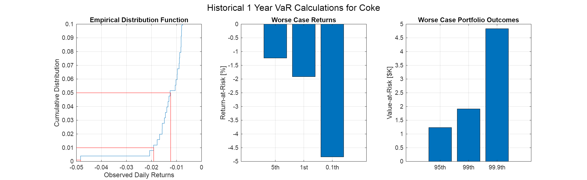
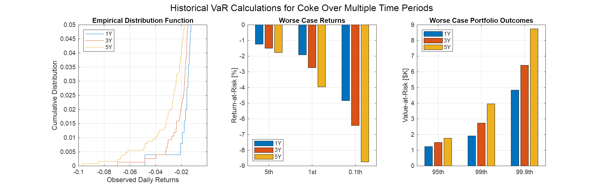
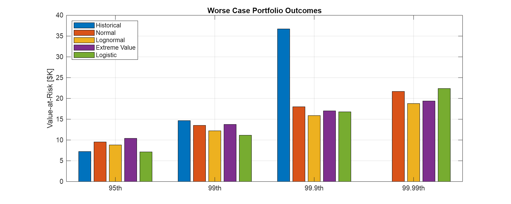
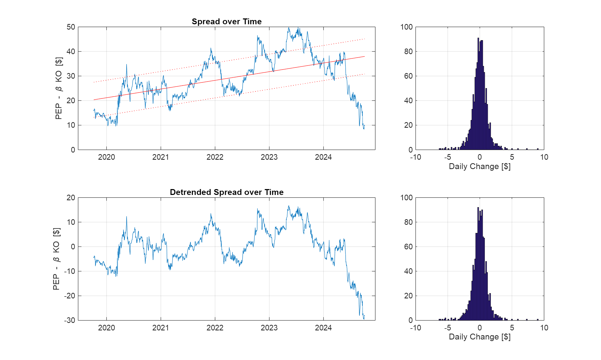
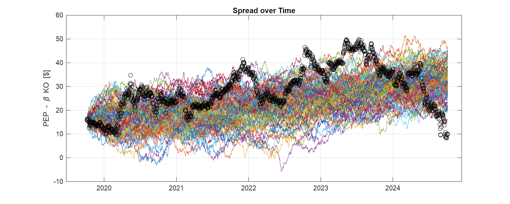
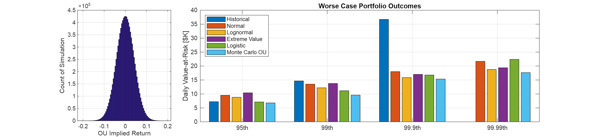
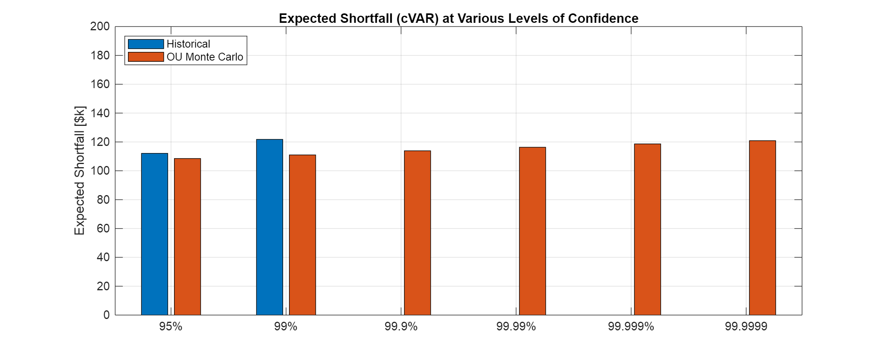
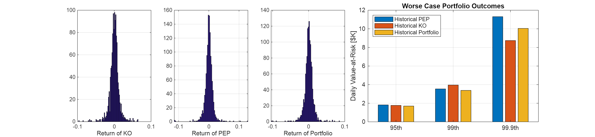

# Class 4 Problem 1 Coke Pepsi VaR
# Problem

Calculate VaR for Coke, Pepsi, and Coke\-Pepsi using historical, parametric, and Monte Carlo methods.

## Download Coke and Pepsi Stock Data
```matlab
% Use Python's yfinance to download KO and PEP historical data for the last 10 years
KO_data = py.yfinance.download('KO', pyargs('period', '5y', 'interval', '1d'));
```

```matlabTextOutput
[*********************100%***********************]  1 of 1 completed
```

```matlab
PEP_data = py.yfinance.download('PEP', pyargs('period', '5y', 'interval', '1d'));
```

```matlabTextOutput
[*********************100%***********************]  1 of 1 completed
```

```matlab
% Convert dataframe to table
TTKO = table(KO_data);
TTPEP = table(PEP_data);

% Clean column names and remove unecessary variables, for now
TTKO = renamevars(TTKO, "Adj Close", "KO");
TTKO = removevars(TTKO,["Date", "Open","High","Low","Close","Volume"]);
TTPEP = renamevars(TTPEP, "Adj Close", "PEP");
TTPEP = removevars(TTPEP,["Open","High","Low","Close","Volume"]);

% Combine into one timetable
TT = [TTPEP TTKO]
```
| |Date|PEP|KO|
|:--:|:--:|:--:|:--:|
|1|07-Oct-2019|119.9965|46.1408|
|2|08-Oct-2019|119.0424|45.8924|
|3|09-Oct-2019|119.5715|46.1065|
|4|10-Oct-2019|119.6062|45.9609|
|5|11-Oct-2019|119.3893|45.6526|
|6|14-Oct-2019|119.2245|45.6526|
|7|15-Oct-2019|118.2531|45.8325|
|8|16-Oct-2019|118.3311|45.8153|
|9|17-Oct-2019|118.7995|46.0723|
|10|18-Oct-2019|118.1836|46.9202|
|11|21-Oct-2019|118.0709|46.4492|
|12|22-Oct-2019|118.5393|46.1237|
|13|23-Oct-2019|119.2245|46.8003|
|14|24-Oct-2019|119.6062|46.7746|

## Define the Important Time Series
```matlab
% Key Time Series
t = datenum(TT.Date);
ko = TTKO.KO;
pep = TTPEP.PEP;

% Define the change and % change in KO and PEP
dKO = diff(ko);
rKO = diff(ko) ./ko(1:end-1);
dPEP = diff(pep);
rPEP = diff(pep) ./pep(1:end-1);

% We want a tighter definition of spread from Class 3
b = regress(pep, ko)
```

```matlabTextOutput
b = 2.7942
```

```matlab
% Choose a number less than b so we don't run into negative prices
spread = pep - 2.25 * ko;

% Define the change and % change in the spread
dSPRD = diff(spread);
rSPRD = diff(spread) ./spread(1:end-1);

% Need this for the first series of qq-plots below
pd = makedist("Normal");

% Results and graphs
figure()
set(gcf, 'Position', [0 0 1300 800])
 
subplot(3,4,[1,2])
plot(t,spread)
datetick('x','yyyy','keeplimits')
ylabel('PEP - \beta KO [ !!!EQ_1!!! ]')
grid on
 
subplot(3,4,7)
hist(rKO*100,50); grid on; title('Histogram of Returns of KO')
xlim([-10 10])
 
subplot(3,4,8)
qqplot(rKO*100, pd); grid on; box on
ylabel('Returns of KO [%]'); xlabel('')
title('QQ-Plot KO')
 
subplot(3,4,[9,10])
plot(t,pep)
datetick('x','yyyy','keeplimits')
ylabel('PEP [ !!!EQ_2!!! 100k
 
T = length(rKO);
I1Yr = T-252+1:T;
I3Yr = T-3*252+1:T;
I5Yr = T-5*252+5:T; % +5 to deal with less than 5 years of data from Yahoo!
 
% Calculate the Return-at-risk over the next day
hRaR_KO_1 = prctile(rKO(I1Yr), [5, 1, 0.1]);
hRaR_KO_3 = prctile(rKO(I3Yr), [5, 1, 0.1]);
hRaR_KO_5 = prctile(rKO(I5Yr), [5, 1, 0.1]);
 
% Calculate Value (of your portfolio) at Risk (over the next day)
hVaR_KO_1 = - PortfolioValue * hRaR_KO_1;
hVaR_KO_3 = - PortfolioValue * hRaR_KO_3;
hVaR_KO_5 = - PortfolioValue * hRaR_KO_5;
```
# B. The One Year Calculation
```matlab
% Results and Graphs
figure()
set(gcf, 'Position', [0 0 1300 400])
 
sgtitle('Historical 1 Year VaR Calculations for Coke')
 
subplot(1,3,1)
ecdf(rKO(I1Yr))
line([-0.05, hRaR_KO_1(1)], [0.05,0.05], 'Color','r'); line([hRaR_KO_1(1), hRaR_KO_1(1)], [0,0.05], 'Color','r');
line([-0.05, hRaR_KO_1(2)], [0.01,0.01], 'Color','r'); line([hRaR_KO_1(2), hRaR_KO_1(2)], [0,0.01], 'Color','r');
line([-0.05, hRaR_KO_1(3)], [0.001,0.001], 'Color','r'); line([hRaR_KO_1(3), hRaR_KO_1(3)], [0,0.001], 'Color','r');
 
set(gca,'XTick',[-0.05:0.01:0])
xlim([-0.05 0])
ylim([0 0.10])
 
ylabel('Cumulative Distribution')
xlabel('Observed Daily Returns')
title('Empirical Distribution Function')
grid on
 
subplot(1,3,2)
bar(hRaR_KO_1 * 100)
set(gca,'XTickLabels',{'5th','1st','0.1th'})
ylabel('Return-at-Risk [%]')
title('Worse Case Returns')
grid on
 
subplot(1,3,3)
bar(hVaR_KO_1/1e3)
set(gca,'XTickLabels',{'95th','99th','99.9th'})
ylabel('Value-at-Risk [ $K]')title('Worse Case Portfolio Outcomes')grid on```
\begin{center}\end{center}\matlabheading{B. Comparing Multiple Time Horizons}```matlab% Results and Graphsfigure()set(gcf, 'Position', [0 0 1300 400]) sgtitle('Historical VaR Calculations for Coke Over Multiple Time Periods') subplot(1,3,1)ecdf(rKO(I1Yr))hold onecdf(rKO(I3Yr))ecdf(rKO(I5Yr))hold off set(gca,'XTick',[-0.1:0.02:0.05])xlim([-0.10 0])ylim([0 0.05])ylabel('Cumulative Distribution')xlabel('Observed Daily Returns')legend({'1Y','3Y','5Y'},'location','northwest')title('Empirical Distribution Function')grid on subplot(1,3,2)bar([hRaR_KO_1; hRaR_KO_3; hRaR_KO_5]' * 100)set(gca,'XTickLabels',{'5th','1st','0.1th'})ylabel('Return-at-Risk [%]')legend({'1Y','3Y','5Y'},'location','southwest')title('Worse Case Returns')grid on subplot(1,3,3)bar([hVaR_KO_1; hVaR_KO_3; hVaR_KO_5]'/1e3)set(gca,'XTickLabels',{'95th','99th','99.9th'})ylabel('Value-at-Risk [$ K]')
legend({'1Y','3Y','5Y'},'location','northwest')
title('Worse Case Portfolio Outcomes')
grid on
```


# C. Full Comparison
```matlab
% What are the worst case losses for Coke
hRaR_PEP_1 = prctile(rPEP(I1Yr), [5, 1, 0.1]);
hRaR_PEP_3 = prctile(rPEP(I3Yr), [5, 1, 0.1]);
hRaR_PEP_5 = prctile(rPEP(I5Yr), [5, 1, 0.1]);
 
% Calculate Value (of your portfolio) at Risk (over the next day)
hVaR_PEP_1 = - PortfolioValue * hRaR_PEP_1
```

```matlabTextOutput
hVaR_PEP_1 = 1x3
1.0e+03 *

1.4660    3.0044    5.2158

```

```matlab
hVaR_PEP_3 = - PortfolioValue * hRaR_PEP_3
```

```matlabTextOutput
hVaR_PEP_3 = 1x3
1.0e+03 *

1.6918    2.8177    5.9453

```

```matlab
hVaR_PEP_5 = - PortfolioValue * hRaR_PEP_5
```

```matlabTextOutput
hVaR_PEP_5 = 1x3
1.0e+04 *

    0.1819    0.3538    1.1306

```

```matlab

% What are the worst case losses for Coke
hRaR_SPRD_1 = prctile(rSPRD(I1Yr), [5, 1, 0.1]);
hRaR_SPRD_3 = prctile(rSPRD(I3Yr), [5, 1, 0.1]);
hRaR_SPRD_5 = prctile(rSPRD(I5Yr), [5, 1, 0.1]);
 
% Calculate Value (of your portfolio) at Risk (over the next day)
hVaR_SPRD_1 = - PortfolioValue * hRaR_SPRD_1;
hVaR_SPRD_3 = - PortfolioValue * hRaR_SPRD_3;
hVaR_SPRD_5 = - PortfolioValue * hRaR_SPRD_5;
 
 
 
% Results and Graphs
figure()
set(gcf, 'Position', [0 0 1300 800])
 
sgtitle('Historical Value at Risk of the Pairs Trade')
 
subplot(2,3,1)
ecdf(rPEP(I1Yr))
hold on
ecdf(rPEP(I3Yr)); ecdf(rPEP(I5Yr))
hold off
 
set(gca,'XTick',[-0.1:0.02:0.05])
xlim([-0.10 0])
ylim([0 0.05])
ylabel('Cumulative Distribution')
xlabel('Observed Daily Returns')
legend({'1Y','3Y','5Y'},'location','northwest')
title('ECDF PEP')
grid on
 
 
subplot(2,3,2)
ecdf(rKO(I1Yr))
hold on
ecdf(rKO(I3Yr)); ecdf(rKO(I5Yr))
hold off
 
set(gca,'XTick',[-0.1:0.02:0.05])
xlim([-0.10 0])
ylim([0 0.05])
ylabel('Cumulative Distribution')
xlabel('Observed Daily Returns')
legend({'1Y','3Y','5Y'},'location','northwest')
title('ECDF KO')
grid on
 
 
subplot(2,3,3)
ecdf(rSPRD(I1Yr))
hold on
ecdf(rSPRD(I3Yr)); ecdf(rSPRD(I5Yr))
hold off
 
xlim([-0.50 0])
ylim([0 0.05])
ylabel('Cumulative Distribution')
xlabel('Observed Daily Returns')
legend({'1Y','3Y','5Y'},'location','northwest')
title('ECDF PEP - \beta KO')
grid on
 
subplot(2,3,4)
bar([hVaR_PEP_1; hVaR_PEP_3; hVaR_PEP_5]'/1e3)
set(gca,'XTickLabels',{'95th','99th','99.9th'})
ylabel('Value-at-Risk [ !!!EQ_4!!! K]')
legend({'1Y','3Y','5Y'},'location','northwest')
title('Worse Case Portfolio Outcomes')
grid on
 
subplot(2,3,6)
bar([hVaR_SPRD_1; hVaR_SPRD_3; hVaR_SPRD_5]'/1e3)
set(gca,'XTickLabels',{'95th','99th','99.9th'})
ylabel('Value-at-Risk [ !!!EQ_5!!! K]')
legend({'Historical','Normal','Lognormal','Extreme Value','Logistic'},'location','northwest')
title('Worse Case Portfolio Outcomes')
grid on
```


# Numerical Method 3: Monte Carlo VaR
# A. Consider the Spread
```matlab
% Use the OU process developed in the last lecture and try and apply it here
 
% https://math.stackexchange.com/questions/1287634/implementing-ornstein-uhlenbeck-in-matlab
 
% Another method to pull out the linear trend ... simple regression
beta = regress(spread, [ones(size(t)), t]);
sTrend = beta(1) + beta(2) * t;
spreadDetrend = spread - sTrend;
sigSpread = std(spread);
 
 
 
% Results and Graphs
figure()
set(gcf, 'Position', [0 0 1000 600])
 
subplot(2,3,[1,2])
plot(t, spread, t, sTrend, 'r', t, sTrend+0.75*sigSpread, 'r:', t, sTrend-0.75*sigSpread, 'r:')
title('Spread over Time')
datetick('x','yyyy','keeplimits')
ylabel('PEP - \beta KO [ $]')grid on subplot(2,3,3)hist(dSPRD, 100)xlim([-10 10])xlabel('Daily Change [$ ]')
grid on
 
subplot(2,3,[4,5])
plot(t, spreadDetrend)
title('Detrended Spread over Time')
datetick('x','yyyy','keeplimits')
ylabel('PEP - \beta KO [ $]')grid on subplot(2,3,6)hist(diff(spreadDetrend), 100)xlim([-10 10])xlabel('Daily Change [$ ]')
grid on
```


# B. Calibrate the OU Process to Model the Mean Reversion
```matlab
% dX = a*(b-X)*dt + sigma * dW
%
%    OR
%
% dX = mu * dt - theta * X * dt + sigma * dW
 
NTrials = 100;
NSteps = T+1;
 
U = rand(NSteps, NTrials);
Z = norminv(U);
Xo = spreadDetrend(1);
 
XOU = zeros(size(U));
XOU(1,:) = Xo;
 
 
 
% Estimate OU Param without Outliers
dSPRDSort = sort(dSPRD);
muOU = mean(dSPRDSort(1:end-5));
%muOU = mean(dSPRDSort(1:end));
sigOU = std(dSPRDSort(100:end-100));
%sigOU = std(dSPRDSort(1:end));
 
dt = 1;
 
theta = 0.005; % calibrated manually ... at some pt we will discuss MLE, time permitting
 
 
for i = 2:NSteps
    XOU(i,:) = XOU(i-1,:) + muOU * dt - theta * XOU(i-1,:) * dt + sigOU * Z(i,:) * sqrt(dt);
end% for i
 
XOUTREND = XOU + sTrend;
 
 
 
% Results and Graphs
figure()
set(gcf, 'Position', [0 0 1000 400])
 
plot(t, XOUTREND, t, spread, 'ko')
title('Spread over Time')
datetick('x','yyyy','keeplimits')
ylabel('PEP - \beta KO [ $]')grid on```
\begin{center}\end{center}\matlabheading{B. Now Compute VaR using the Calibrated OU Process Using Monte Carlo}```matlab% Now to compute VaR using the Monte Carlo processNTrials = 10000000; % 10M trialsNSteps = 1; U = rand(NSteps, NTrials);Z = norminv(U);Xo = spreadDetrend(1);%Xo = -10; dXOU = zeros(size(U));XOU = zeros(2,NTrials); XOU(1,:) = Xo;XOU(2,:) = XOU(1,:) + muOU * dt - theta * XOU(1,:) * dt + sigOU * Z(1,:) * sqrt(dt); XOUTREND = XOU + sTrend(1:2);rXOUTREND = diff(XOUTREND)./XOUTREND(1,:); mcOUVAR_SPRD_5 = - PortfolioValue * (prctile(rXOUTREND, [5, 1, 0.01, 0.001]));  % Results and Graphsfigure()set(gcf, 'Position', [0 0 1300 300]) subplot(1,4,1)hist(rXOUTREND, 100)xlabel('OU Implied Return')ylabel('Count of Simulation')grid on  subplot(1,4,[2:4])bar([[hVaR_SPRD_5, NaN]; ...     pNormalVAR_SPRD_5; ...     pLognormalVAR_SPRD_5; ...     pGevVAR_SPRD_5; ...     pLogisticVAR_SPRD_5; ...     mcOUVAR_SPRD_5]'/1e3) set(gca,'XTickLabels',{'95th','99th','99.9th','99.99th'})ylabel('Daily Value-at-Risk [$ K]')
legend({'Historical','Normal','Lognormal','Extreme Value','Logistic','Monte Carlo OU'},'location','northwest')
title('Worse Case Portfolio Outcomes')
grid on
```


# C. Compute Conditional VaR  (cVAR) using the Calibrated OU Process Using Monte Carlo
```matlab
% cVAR = Expected Shortfall = E[Loss|Var Exceeded]
 
% Expected Shortfall Assuming Daily 95% VaR
 
% Calculate Returns at various Percentiles
hReturnAtRisk = prctile(rSPRD, [5, 1, 0.1, 0.01, 0.001, 0.0001]);
OUReturnAtRisk = prctile(rXOUTREND, [5, 1, 0.1, 0.01, 0.001, 0.0001]);
 
% Some Storage Variables for our Experiment
hExpectedShortfall = NaN(size(OUReturnAtRisk));
OUExpectedShortfall = NaN(size(OUReturnAtRisk));
 
% cVAR Calculation
for i = 1:length(OUReturnAtRisk)
 
    I = find(rSPRD <= hReturnAtRisk(i));
 
    % Need a minimum # of values to calculate averages
    if length(I) > 10    
        hExpectedShortfall(i) = PortfolioValue * (1 - mean(rSPRD(I)));
    end
 
    % 10M trials here, no worry of minimums
    I = find(rXOUTREND <= OUReturnAtRisk(i));
    OUExpectedShortfall(i) = PortfolioValue * (1 - mean(rXOUTREND(I)));
 
end
 
 
% Results and Graphs
figure()
set(gcf, 'Position', [0 0 1000 400])
 
bar([hExpectedShortfall; OUExpectedShortfall]'/1e3)
ylim([0 200])
title('Expected Shortfall (cVAR) at Various Levels of Confidence')
ylabel('Expected Shortfall [ $k]')set(gca,'XTickLabels',{'95%','99%','99.9%','99.99%','99.999%','99.9999'})legend({'Historical','OU Monte Carlo'}, 'location', 'northwest')grid on```
\begin{center}\end{center}\matlabtitle{Portfolios ... a Short Introduction}```matlab% Portfolio of Coke and Pepsi  % Calculate the equally weighted portfoliorDailyPortfolio = 0.5 * rKO + 0.5 * rPEP; % Calculate the historical VAR of the equally weighted portfoliohVaR_Portfolio = - PortfolioValue * prctile(rDailyPortfolio, [5, 1, 0.1]);  % Results and Graphsfigure()set(gcf, 'Position', [0 0 1300 300]) subplot(1,5,1)hist(rKO, 100)xlabel('Return of KO')grid on subplot(1,5,2)hist(rPEP, 100)xlabel('Return of PEP')grid on subplot(1,5,3)hist(rDailyPortfolio, 100)xlabel('Return of Portfolio')grid on subplot(1,5,[4,5])bar([hVaR_PEP_5; ...     hVaR_KO_5; ...     hVaR_Portfolio]'/1e3) set(gca,'XTickLabels',{'95th','99th','99.9th'})ylabel('Daily Value-at-Risk [$ K]')
legend({'Historical PEP','Historical KO','Historical Portfolio'},'location','northwest')
title('Worse Case Portfolio Outcomes')
grid on
```




