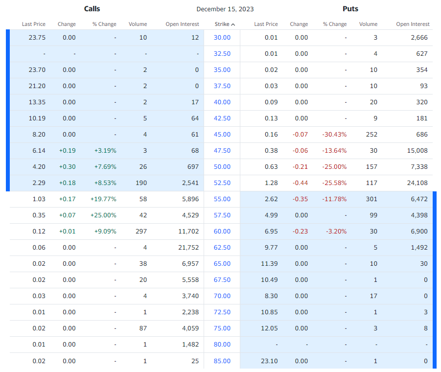
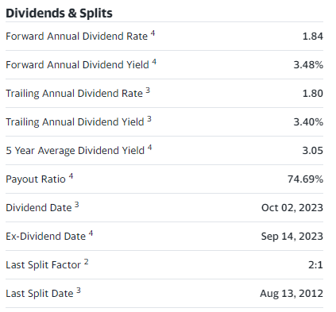
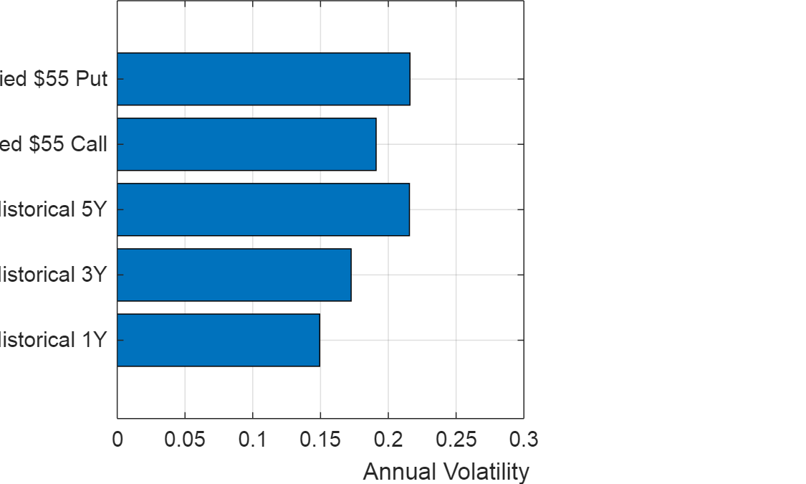
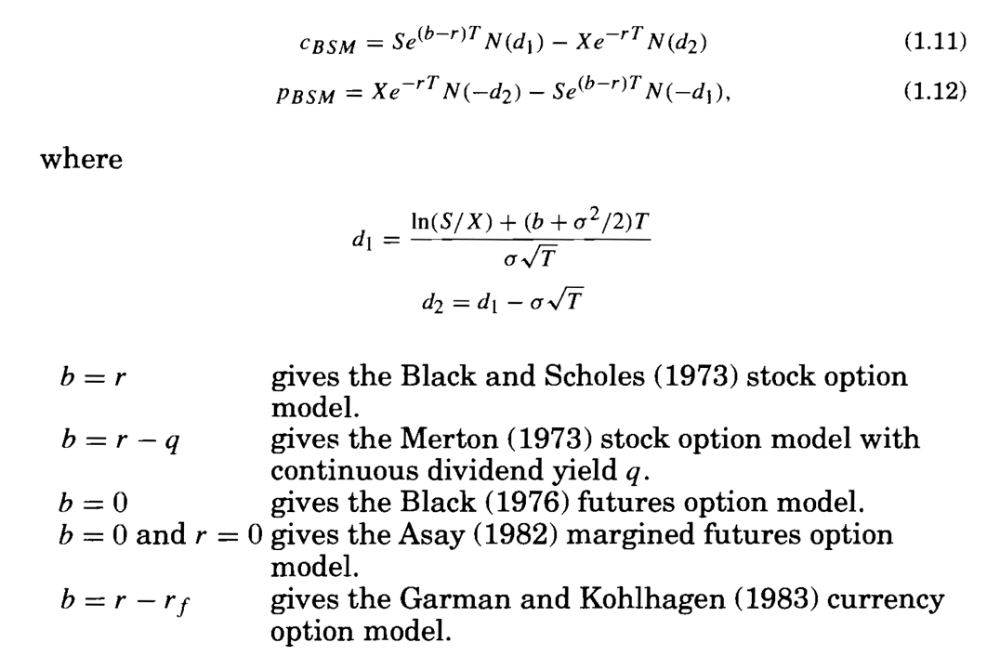
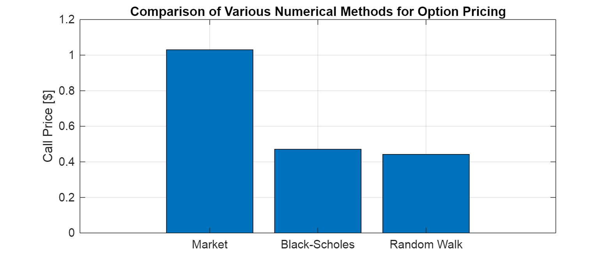
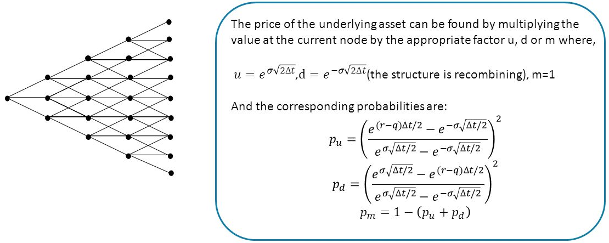
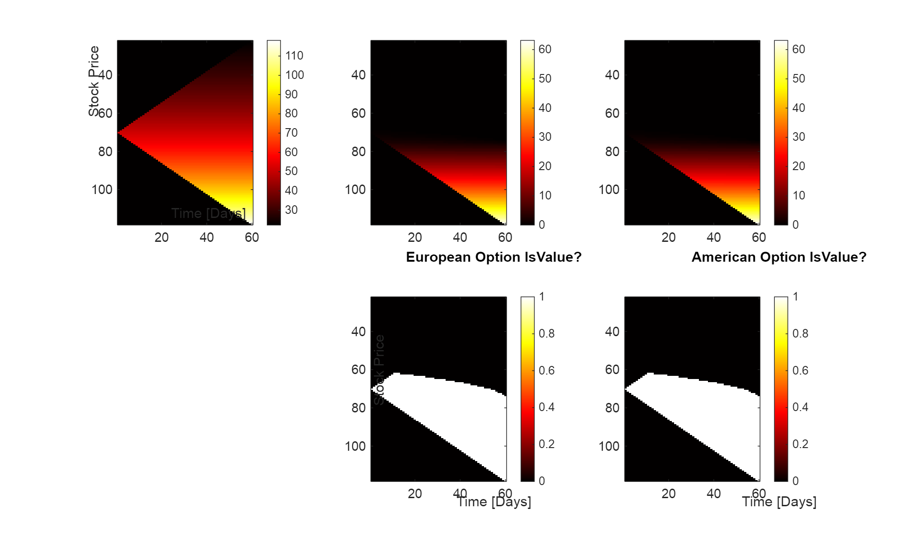
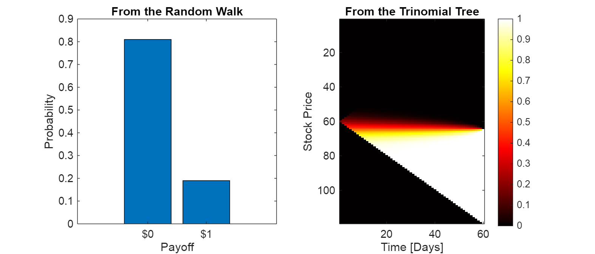
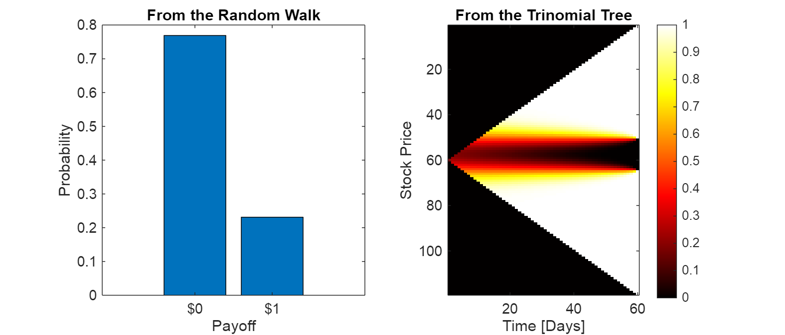
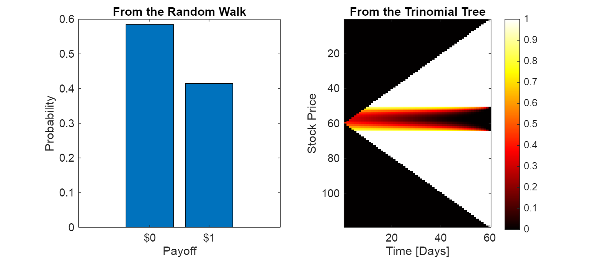

# Class 5 Problem 1 Derivative Pricing KO
# Problem

Calculate the value of call option on KO or PEP using the following numerical methods:

-  Black\-Scholes 
-  Random Walks 
-  Trees 
-  PDE 
## 0. Download Option Prices for KO

At 10:44am KO's [price](https://ca.finance.yahoo.com/quote/KO/options?date=1702598400&p=KO&straddle=false) was given as \$53.40. A snap of the call option chain is below. 


We will focus on the \$55 dollar level for the exercise.


The implied volatility for the \$55 strike call was 18.3% and for the \$55 strike put was 22.0%.

```matlab
C_MKT = 1.03;
P_MKT = 2.62;
```




Their dividend data is as follows:





```matlab
% Download data for Coke
startDate = '2018-10-16';
endDate = '2024-10-13';
KO_data = py.yfinance.download('KO', pyargs('start', startDate, 'end', endDate, 'interval', '1d'));
```

```matlabTextOutput
[*********************100%***********************]  1 of 1 completed
```

```matlab
TTKO = table(KO_data);
TTKO = TTKO(1:1257, :);
TTKO = renamevars(TTKO, ["Adj Close"], ["Price"]);
TTKO = removevars(TTKO,["Open","High","Low","Close","Volume"])
```
| |Date|Price|
|:--:|:--:|:--:|
|1|16-Oct-2018|37.7501|
|2|17-Oct-2018|38.0571|
|3|18-Oct-2018|37.8497|
|4|19-Oct-2018|38.4471|
|5|22-Oct-2018|38.1484|
|6|23-Oct-2018|38.4721|
|7|24-Oct-2018|38.7791|
|8|25-Oct-2018|38.5965|
|9|26-Oct-2018|38.1069|
|10|29-Oct-2018|38.5550|
|11|30-Oct-2018|39.5260|
|12|31-Oct-2018|39.7334|
|13|01-Nov-2018|39.6172|
|14|02-Nov-2018|39.8330|

```matlab
% What is the historical volatility of the stock over different time frames
tHistorical = datenum(TTKO.Date);
SHistorical = TTKO.Price;
rKO = diff(SHistorical) ./ SHistorical(1:end-1);
 
sigmaHist1YEAR = std(rKO(end-252+1:end)) * sqrt(252);
sigmaHist3YEAR = std(rKO(end-2*252+1:end)) * sqrt(252);
sigmaHist5YEAR = std(rKO(1:end)) * sqrt(252);
 
sigma55Call = 0.191; % from the option chain in Yahoo! 20.6
sigma55Put = 0.216; % from the option chain in Yahoo!
 
% Results and Output
figure()
set(gcf,'Position',[0,0,500,300])
 
barh([sigmaHist1YEAR, sigmaHist3YEAR, sigmaHist5YEAR, sigma55Call, sigma55Put])
 
xlabel('Annual Volatility')
set(gca,'YTickLabels', {'Historical 1Y', ...
                        'Historical 3Y', ...
                        'Historical 5Y',... 
                        'Implied  !!!EQ_1!!! 55 Put'})
xlim([0 0.3])
box on
grid on
```


## 1. Black\-Scholes\-Merton Model



```matlab
% Basic Market Observations
 
So = SHistorical(end); %53.40; % Current stock price
K = 55; % Strike price for example
r = 0.0531; % SOFR rate of 5.31%
%sigma = 0.1920; % 19.2% from the option chain on Yahoo!
q = 0.018; % trailing annual dividend yield
 
% Prepping the Calculation
 
% For December 15, 2002 we calculate T in years
To = datenum(2023,10,16);
TExpiration = datenum(2023,12,15);
TDays = (TExpiration - To); % in days
T = (TExpiration - To) / 365; % in years
 
% The "known" part
b = r - q;
 
% Calculate Black Scholes price for the option
d1 = (log(So/K) + (b + sigma55Call^2 / 2)*T) / (sigma55Call*sqrt(T));
d2 = d1 - sigma55Call * sqrt(T);
 
C_BSM = So * exp((b-r)*T) * normcdf(d1) - K * exp(-r*T) * normcdf(d2)
```

```matlabTextOutput
C_BSM = 0.4709
```

```matlab
d1 = (log(So/K) + (b + sigma55Put^2 / 2)*T) / (sigma55Put*sqrt(T));
d2 = d1 - sigma55Put * sqrt(T);
 
P_BSM = K * exp(-r*T) * normcdf(-d2) - So * exp((b-r)*T) * normcdf(-d1);
 
% Results and Output
figure()
set(gcf,'Position',[0,0,500,300])
 
bar([C_MKT, C_BSM; P_MKT ,P_BSM])
title('Comparison of Various Numerical Methods for Option Pricing')
ylabel('Price [ !!!EQ_2!!! ]')
ylim([35,70])
grid on
 
% Graph KO price at expiration
subplot(1,4,3)
 
[fBin,SBin] = hist(S_RW(end,:),10);
 
barh(SBin, fBin)
ylim([35,70])
grid on
title('Risk Neutral Stock Price')
xlabel('Count')
 
% Graph option price at expiration
subplot(1,4,4)
 
 
barh(PriceExp, CountExp)
title('Risk Neutral Option Price')
grid on
xlabel('Count')
ylabel('Option Price [ !!!EQ_3!!! ]')
set(gca, 'XTickLabels', {'Market','Black-Scholes','Random Walk'})
 
box on
grid on
```


## 3. Trinomial Trees \- Grid Method



```matlab
% Parameters for the Trinomial Tree
 
u = exp(sigmaRwDays*sqrt(2*dt));
d = exp(-sigmaRwDays*sqrt(2*dt));
m = 1;
 
numUp = exp(bRwDays * dt/2) - exp(-sigmaRwDays * sqrt(dt/2));
numDn = exp(sigmaRwDays * sqrt(dt/2)) - exp(bRwDays * dt/2);
den = exp(sigmaRwDays * sqrt(dt/2)) - exp(-sigmaRwDays * sqrt(dt/2));
 
pu = (numUp/den)^2;
pd = (-numDn/den)^2;
pm = 1 - (pu + pd);
 
 
% The Stock Tree on the Grid
TriGridHeight = 2 * NSteps - 1;
TriGridWidth = NSteps;
 
STriGrid = NaN(TriGridHeight, TriGridWidth);
 
TAxis = 1:NSteps;
SAxis = zeros(TriGridHeight,1);
 
for i = 1:TriGridHeight
    
    if i < TriGridHeight / 2
       SAxis(i) = So * d ^ (floor(TriGridHeight / 2) - i + 1);
    elseif i > TriGridHeight / 2 + 1
       SAxis(i) = So * u ^ (i - ceil(TriGridHeight / 2));
    elseif i == NSteps
       SAxis(i) = So;
    end%if
 
end%for i
 
 
% Fill in the Trinomial Tree in the grid
for j = 1:NSteps
 
    IBeg = NSteps - j + 1;
    IEnd = NSteps + j - 1;
    I = IBeg:IEnd;
 
    STriGrid(I,j) = SAxis(I);
 
end%for i
 
 
%%% Core Routine Starts here
 
% Determine the option Value ... bit more detailed here
VIntrinsic = max(STriGrid - 55, 0);
VEuro = NaN(size(STriGrid));
VAmer = NaN(size(STriGrid));
 
% Backward Induction
for j = NSteps:-1:1
 
    IBeg = NSteps - j + 1;
    IEnd = NSteps + j - 1;
    I = IBeg:IEnd;
 
    for i = 1:length(I)
 
        IntrinsicValue = VIntrinsic(I(i),j);
 
        if j == NSteps
    
            % Option prices at maturity are just Intrinsic Values
            VEuro(I(i), j) = IntrinsicValue;
            VAmer(I(i), j) = IntrinsicValue;
 
        else
 
            % The Backward Induction Algorithm
 
            VEuro(I(i), j) = exp(-bRwDays*dt) * (pu * VEuro(I(i)+1, j+1) + ...
                                                 pm * VEuro(I(i),   j+1) + ...
                                                 pd * VEuro(I(i)-1, j+1) );
 
            VAmer(I(i), j) = max(IntrinsicValue, exp(-bRwDays*dt) * (pu * VAmer(I(i)+1, j+1) + ...
                                                                     pm * VAmer(I(i),   j+1) + ...
                                                                     pd * VAmer(I(i)-1, j+1) ) );
        end%if
 
    end%for i
 
end%for j
 
VIntrinsic(NSteps,1)
```

```matlabTextOutput
ans = 0
```

```matlab

C_TRI_EURO = VEuro(NSteps,1)
```

```matlabTextOutput
C_TRI_EURO = 0.4599
```

```matlab
C_TRI_AMER = VAmer(NSteps,1)
```

```matlabTextOutput
C_TRI_AMER = 0.4599
```

```matlab

figure()
set(gcf, 'Position', [0,0,1000,600])
 
colormap(hot)
 
subplot(2,3,1)
imagesc(TAxis, SAxis, STriGrid)
colorbar
title('Stock Price')
ylabel('Stock Price')
xlabel('Time [Days]')
 
subplot(2,3,2)
imagesc(TAxis, SAxis, VEuro)
colorbar
title('European Option Price')
 
subplot(2,3,3)
nonzeroVAmer = zeros(size(VAmer));
nonzeroVAmer(VAmer > 0.001) = 1;
imagesc(TAxis, SAxis, VAmer)
colorbar
title('American Option Price')
 
 
subplot(2,3,5)
nonzeroVEuro = zeros(size(VEuro));
nonzeroVEuro(VEuro > 0.001) = 1;
imagesc(TAxis, SAxis, nonzeroVEuro)
colorbar
title('European Option IsValue?')
ylabel('Stock Price')
xlabel('Time [Days]')
 
subplot(2,3,6)
nonzeroVAmer = zeros(size(VAmer));
nonzeroVAmer(VAmer > 0.001) = 1;
imagesc(TAxis, SAxis, nonzeroVAmer)
colorbar
title('American Option IsValue?')
xlabel('Time [Days]')
```



```matlab

% Update on call option price by various methods
figure()
 
set(gcf,'Position',[0,0,800,300])
 
bar([C_MKT, C_BSM, C_RW, C_TRI_EURO, C_TRI_AMER])
title('Comparison of Various Numerical Methods for Option Pricing')
ylabel('Call Price [ !!!EQ_4!!! 1,');  % Add commas
end
disp(num2bank(1e6 * BinaryValueRW))
```

```matlabTextOutput
190,000.00
```
### (2) Binary Option via Trinomial Tree
```matlab
% Determine the option Value
BinaryIntrinsic = zeros(size(STriGrid));
BinaryIntrinsic(STriGrid >= 55) = 1;
BinaryEuro = NaN(size(STriGrid));
 
% Backward Induction
for j = NSteps:-1:1
 
    I = (NSteps - j + 1):(NSteps + j - 1);
 
    for i = 1:length(I)
        
        if j == NSteps    
            % Option prices at maturity are just Intrinsic Values
            BinaryEuro(I(i), j) = BinaryIntrinsic(I(i),j);
        else
            % The Backward Induction Algorithm
            BinaryEuro(I(i), j) = exp(-bRwDays*dt) * (pu * BinaryEuro(I(i)+1, j+1) + ...
                                                      pm * BinaryEuro(I(i),   j+1) + ...
                                                      pd * BinaryEuro(I(i)-1, j+1) );
        end%if
    end%for i
end%for j
 
disp(BinaryEuro(NSteps,1))
```

```matlabTextOutput
    0.2127
```

```matlab

disp(num2bank(1000000 * BinaryEuro(NSteps,1)))
```

```matlabTextOutput
212,742.80
```

```matlab

% Results and Graphs
figure()
set(gcf,'Position',[0,0,700,300])
 
subplot(1,2,1)
bar(ProbExp)
title('From the Random Walk')
ylabel('Probability')
xlabel('Payoff')
set(gca,'XTickLabels',{' !!!EQ_5!!! 1'})
 
subplot(1,2,2)
imagesc(BinaryEuro)
title('From the Trinomial Tree')
xlabel('Time [Days]')
ylabel('Stock Price')
colormap(hot)
colorbar
```


## 5. Application: Double Binary Option

Client calls back and asks for a market on:


Barrier Option has value \$1,000,000 if stock at expiration above \$55 and below \$55 strike call was 18.3% and for the \$','$1'}) subplot(1,2,2)imagesc(DblBinaryEuro)title('From the Trinomial Tree')xlabel('Time [Days]')ylabel('Stock Price')colormap(hot)colorbar```
## 6. Application: One-Touch Double Binary OptionClient calls back and asks for a market on:Barrier Option has value \$1,000,000 if stock hits \$55 or \$45 at any time before expiration, zero otherwise. Epxires Dec 15, 2023, just like the calls above.### (1) Double Binary Option via Random Walk\hfill \break```matlab% Calculate value of the Binary optionB3_RW = zeros(size(S_RW));for j=1:size(S_RW,2)    for i=1:size(S_RW,1)        if S_RW(i,j) >= 55 | S_RW(i,j) <= 45            B3_RW(i:end,j) = 1;            break        end    endend B3_RW_Expiration = B3_RW(end,:); PriceExp = [0,1];CountExp = hist(B3_RW_Expiration, PriceExp); ProbExp = CountExp / NTrials; B3ValueRW = PriceExp * ProbExp' % expected value of the option price```
\begin{matlaboutput}B3ValueRW = 0.4150\end{matlaboutput}```matlab
disp(num2bank(1e6 * B3ValueRW))```
\begin{matlaboutput}415,000.00\end{matlaboutput}### (2) Double Binary Option via Trinomial Tree\hfill \break```matlab% Determine the option ValueDblBinary3Intrinsic = zeros(size(STriGrid));DblBinary3Intrinsic((STriGrid >= 55) | (STriGrid <= 45)) = 1;DblBinary3Amer = NaN(size(STriGrid));DblBinary3Euro = NaN(size(STriGrid));  % Backward Inductionfor j = NSteps:-1:1     I = (NSteps - j + 1):(NSteps + j - 1);     for i = 1:length(I)         IntrinsicValue = DblBinary3Intrinsic(I(i),j);         if j == NSteps                % Option prices at maturity are just Intrinsic Values            DblBinary3Euro(I(i), j) = IntrinsicValue; %DblBinary3Intrinsic(I(i),j);            DblBinary3Amer(I(i), j) = IntrinsicValue; %DblBinary3Intrinsic(I(i),j);        else            % The Backward Induction Algorithm            DblBinary3Euro(I(i), j) = exp(-bRwDays*dt) * (pu * DblBinary3Euro(I(i)+1, j+1) + ...                                                          pm * DblBinary3Euro(I(i),   j+1) + ...                                                          pd * DblBinary3Euro(I(i)-1, j+1) );             % The Backward Induction Algorithm ... American            DblBinary3Amer(I(i), j) = max(IntrinsicValue, exp(-bRwDays*dt) * ...                                                             (pu * DblBinary3Amer(I(i)+1, j+1) + ...                                                              pm * DblBinary3Amer(I(i),   j+1) + ...                                                              pd * DblBinary3Amer(I(i)-1, j+1))); ...         end%if    end%for iend%for j   DblBinary3Euro(NSteps,1)```
\begin{matlaboutput}ans = 0.2495\end{matlaboutput}```matlab
DblBinary3Amer(NSteps,1)```
\begin{matlaboutput}ans = 0.4317\end{matlaboutput}```matlab
disp(num2bank(1000000 * DblBinary3Amer(NSteps,1)))```
\begin{matlaboutput}431,726.37\end{matlaboutput}```matlab
% Results and Graphsfigure()set(gcf,'Position',[0,0,700,300]) subplot(1,2,1)bar(ProbExp)title('From the Random Walk')ylabel('Probability')xlabel('Payoff')set(gca,'XTickLabels',{' $0','$ 1'})
 
subplot(1,2,2)
imagesc(DblBinary3Amer)
title('From the Trinomial Tree')
xlabel('Time [Days]')
ylabel('Stock Price')
colormap(hot)
colorbar
```


