# Class 7 Problem 1 Copula Introduction
```matlab
clc, clear all, close all
rng(1005778428);
```
# Problem

Viewing JDF of KO and PEP as a copula

## Download Option Prices for KO and PEP
```matlab
% Download data for Coke and Pepsi from Yahoo!Finance
startDate = '2018-10-16';
endDate = '2023-10-13';
KO_data = py.yfinance.download('KO', pyargs('start', startDate, 'end', endDate, 'interval', '1d'));
```

```matlabTextOutput
[*********************100%***********************]  1 of 1 completed
```

```matlab
PEP_data = py.yfinance.download('PEP', pyargs('start', startDate, 'end', endDate, 'interval', '1d'));
```

```matlabTextOutput
[*********************100%***********************]  1 of 1 completed
```

```matlab
TTKO = table(KO_data);
TTPEP = table(PEP_data);

% Clean column names and remove unecessary variables, for now
TTKO = renamevars(TTKO, ["Adj Close"], ["KO"]);
TTPEP = renamevars(TTPEP, ["Adj Close"], ["PEP"]);
 
TTKO = removevars(TTKO,["Date", "Open","High","Low","Close","Volume"]);
TTPEP = removevars(TTPEP,["Open","High","Low","Close","Volume"]);
 
% Combine into one timetable
TT = [TTPEP TTKO]
```
| |Date|PEP|KO|
|:--:|:--:|:--:|:--:|
|1|16-Oct-2018|90.3823|37.7501|
|2|17-Oct-2018|91.1566|38.0571|
|3|18-Oct-2018|90.8368|37.8497|
|4|19-Oct-2018|92.8230|38.4472|
|5|22-Oct-2018|92.0740|38.1484|
|6|23-Oct-2018|92.6884|38.4720|
|7|24-Oct-2018|95.0702|38.7791|
|8|25-Oct-2018|94.9776|38.5965|
|9|26-Oct-2018|92.9577|38.1069|
|10|29-Oct-2018|95.0113|38.5550|
|11|30-Oct-2018|95.7519|39.5260|
|12|31-Oct-2018|94.5820|39.7334|
|13|01-Nov-2018|93.8498|39.6173|
|14|02-Nov-2018|93.5637|39.8330|

## Define Important Time Series
```matlab
% Key Time Series
t = datenum(TT.Date);
ko = TTKO.KO;
pep = TTPEP.PEP;
 
% define the change and % change in KO and PEP
rKO = diff(ko) ./ ko(1:end-1);
rPEP = diff(pep) ./ pep(1:end-1);
 
% Calculate Correlations
corrcoef([rKO,rPEP])
```

```matlabTextOutput
ans = 2x2
1.0000    0.7563
    0.7563    1.0000

```

```matlab
figure()
 
%plot(rKO, rPEP, 'o')
scatterhist(rKO, rPEP, 'NBins', 20, 'Location', 'NorthEast', 'Kernel','overlay');
set(gca,'XTick',[-0.05:0.01:0.05])
set(gca,'YTick',[-0.05:0.01:0.05])
xlim([-0.05 0.05])
ylim([-0.05 0.05])
xlabel('Returns of Coke')
ylabel('Returns of Pepsi')
grid on
```

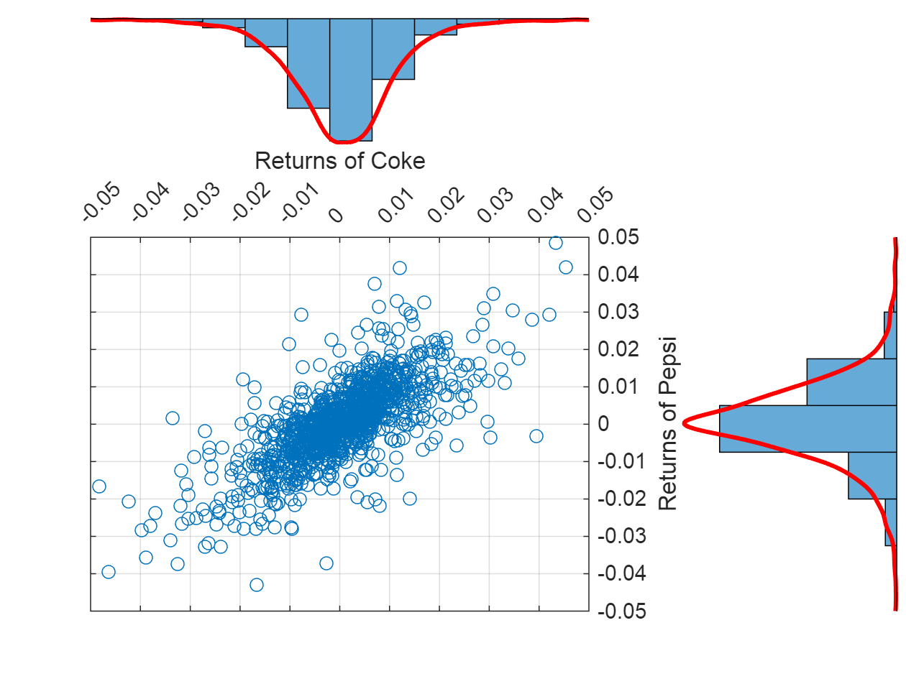

```matlab
figure()
plot(sort(rKO),sort(rPEP),'o')
xlabel('Returns of Coke')
ylabel('Returns of Pepsi')
grid on
```

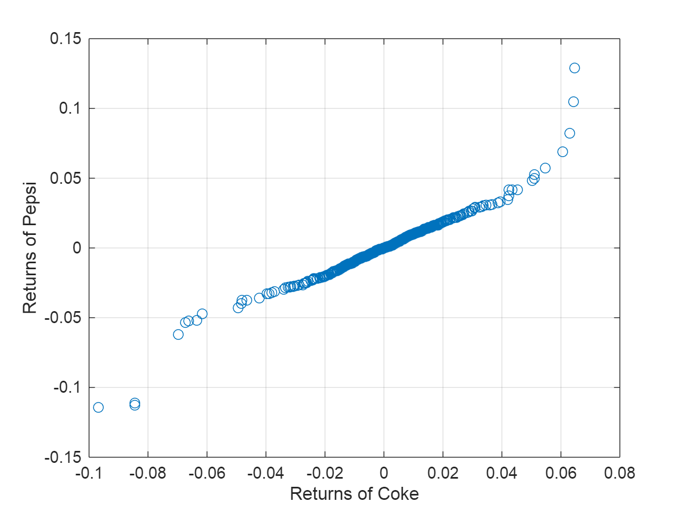

But there are many other datasets with much more structured depandencies.


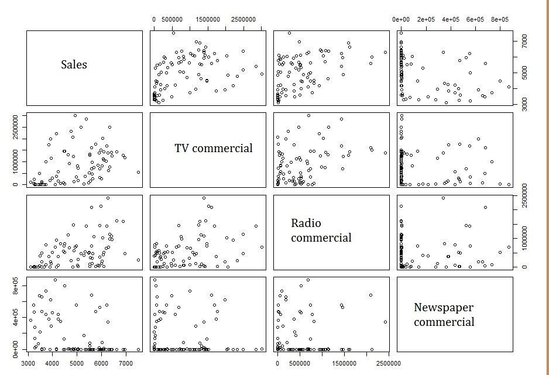

## Copulas and Empirical Marginal Distributions

To simulate dependent multivariate data using a copula, we need to specify:


 `1) the copula family (and any shape parameters),` 


 `2) the rank correlations among variables, and` 


 `3) the marginal distributions for each variable` 


Suppose we have two sets of stock return data, and we would like to run a Monte Carlo simulation with inputs that follow the same distributions as our data.

```matlab
figure()
set(gcf,'Position',[0,0,700,300])
 
nobs = size(rKO,1);
 
subplot(1,2,1);
hist(rKO, 20);
xlabel('Returns Coke');
ylabel('Count');
grid on
 
subplot(1,2,2);
hist(rPEP, 20);
xlabel('Returns Pepsi');
ylabel('Count');
grid on
```

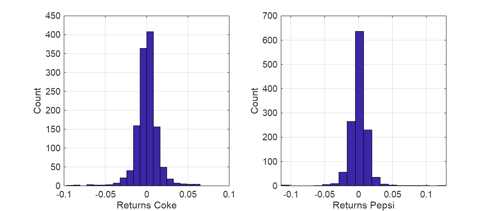

We could fit a parametric model separately to each dataset, and use those estimates as our marginal distributions. However, a parametric model may not be sufficiently flexible. Instead, we can use an empirical model for the marginal distributions. We only need a way to compute the inverse CDF.

### The Inverse CDF \- A Key Input
```matlab
invCDF1 = sort(rKO(end-50+1:end));
invCDF2 = sort(rPEP(end-50+1:end));
 
invCDFKO = sort(rKO);
invCDFPEP = sort(rPEP);
 
 
figure()
set(gcf,'Position',[0,0,700,700])
 
subplot(2,2,1);
stairs((1:50)/50, invCDF1,'r');
hold on;
stairs((1:50)/50, invCDF2,'b');
hold off;
legend('KO','PEP');
title('Last 50 days')
xlabel('Cumulative Probability');
ylabel('Returns');
grid on
 
subplot(2,2,2);
stairs((1:nobs)/nobs, invCDFKO, 'r');
hold on;
stairs((1:nobs)/nobs, invCDFPEP, 'b');
hold off;
legend('KO','PEP');
title('Last 5 Years')
xlabel('Cumulative Probability');
ylabel('Returns');
grid on
 
subplot(2,2,3);
stairs(invCDF1, (1:50)/50,'r');
hold on;
stairs(invCDF2,(1:50)/50,'b');
hold off;
legend('KO','PEP');
title('Last 50 days')
ylabel('Cumulative Probability');
xlabel('Returns');
grid on
 
subplot(2,2,4);
stairs(invCDFKO, (1:nobs)/nobs, 'r');
hold on;
stairs(invCDFPEP, (1:nobs)/nobs, 'b');
hold off;
legend('KO','PEP');
title('Last 5 Years')
ylabel('Cumulative Probability');
xlabel('Returns');
grid on
```

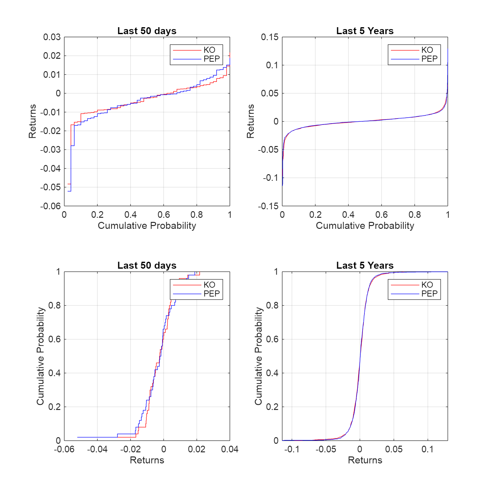
### The Actual Copula
```matlab
% Generate the Copula Data
% Step 1: Calculate ECDF for KO and PEP returns
[fKO, xKO] = ecdf(rKO); % ECDF values for KO
[fPEP, xPEP] = ecdf(rPEP); % ECDF values for PEP

% Add a small random noise to duplicate values to ensure uniqueness
xKO = xKO + (rand(size(xKO)) - 0.5) * 1e-10;
xPEP = xPEP + (rand(size(xPEP)) - 0.5) * 1e-10;

% Step 2: Map returns to ECDF values for the copula
uEcdfKO = interp1(xKO, fKO, rKO, 'linear', 'extrap');
uEcdfPEP = interp1(xPEP, fPEP, rPEP, 'linear', 'extrap');

figure()
 
scatterhist(uEcdfKO, uEcdfPEP, 'NBins', 20, 'Location', 'NorthEast')
xlabel('KO')
ylabel('PEP')
grid on
```

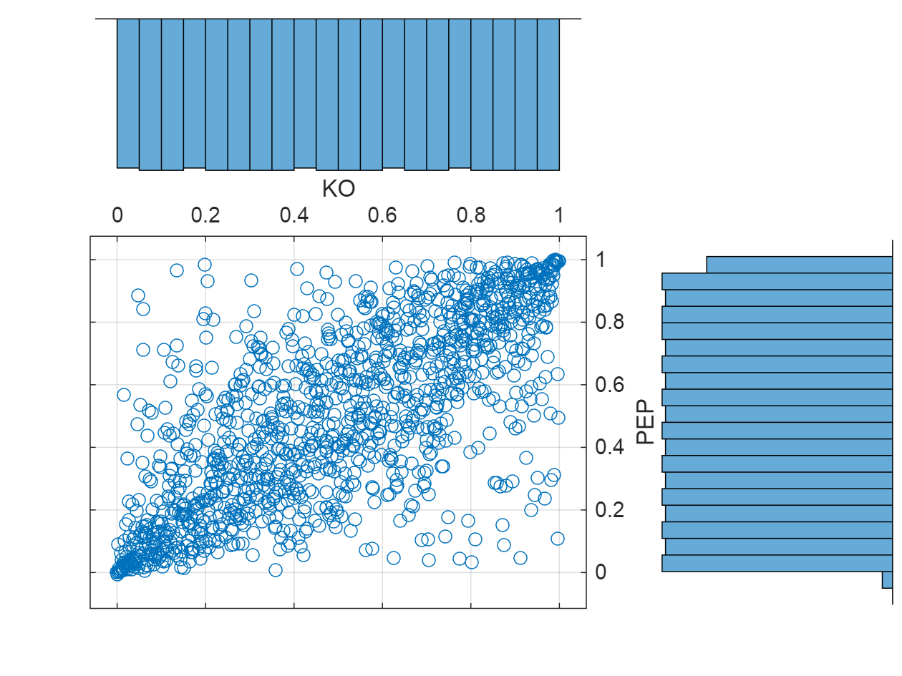

```matlab
figure()
set(gcf,'Position',[0,0,700 300])
 
subplot(1,2,1)
plot(uEcdfKO, uEcdfPEP, 'o')
title('Copula')
xlabel('ECDF(Returns KO)')
ylabel('ECDF(Returns PEP)')
grid on
 
subplot(1,2,2)
plot(rKO, rPEP, 'o')
title('Joint Distribution')
xlabel('Returns KO')
ylabel('Returns PEP')
xlim([-0.04 +0.04])
ylim([-0.04 +0.04])
grid on
```

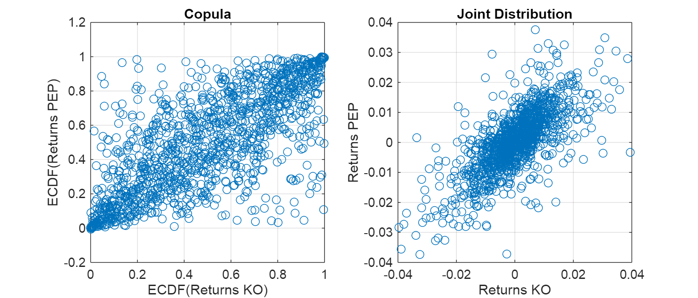
## Eample 1: Cholesky Decomposition Copula
```matlab
% Generate u1 and u2, normal random variables
u1 = rand(1000,1);
u2 = rand(1000,1);

% Convert uniform random variables to standard normal
x1 = norminv(u1);
x2 = norminv(u2);

% Define correlation and Cholesky decomposition
rho = 0.7563;
C = [1, rho; rho, 1];
L = chol(C, 'upper');

% Generate correlated normal random variables
y = [x1, x2] * L;

% Scale y to have the mean and std of rKO and rPEP
yKO = mean(rKO) + y(:,1) * std(rKO);
yPEP = mean(rPEP) + y(:,2) * std(rPEP);

% Create sorted ECDF values for yKO and yPEP
invCDFCholKO = sort(yKO);
invCDFCholPEP = sort(yPEP);

% Map yKO and yPEP to uniform [0,1] quantiles using interpolation
uEcdfCholKO = interp1(invCDFCholKO, linspace(0,1,length(invCDFCholKO)), yKO, 'linear', 'extrap');
uEcdfCholPEP = interp1(invCDFCholPEP, linspace(0,1,length(invCDFCholPEP)), yPEP, 'linear', 'extrap');

% Plotting the results
figure();
set(gcf,'Position',[0,0,700 200]);

subplot(1,4,1);
plot(uEcdfKO, uEcdfPEP, '.');
title('Actual Copula');
xlabel('ECDF(Returns KO)');
ylabel('ECDF(Returns PEP)');
ylim([0 1]);
grid on;

subplot(1,4,2);
plot(uEcdfCholKO, uEcdfCholPEP, '.');
title('Cholesky Copula');
xlabel('ECDF(Returns KO)');
ylabel('ECDF(Returns PEP)');
grid on;

subplot(1,4,3);
plot(yKO, yPEP, '.');
title('Cholesky Joint Distribution');
xlabel('Returns KO');
ylabel('Returns PEP');
xlim([-0.04 +0.04]);
ylim([-0.04 +0.04]);
grid on;

subplot(1,4,4);
plot(rKO, rPEP, '.');
title('Actual Joint Distribution');
xlabel('Returns KO');
ylabel('Returns PEP');
xlim([-0.04 +0.04]);
ylim([-0.04 +0.04]);
grid on;
```

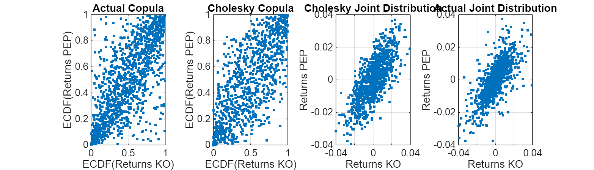
## Example 2: t\-Distribution Copula
```matlab
nu = 5;
tau = corr(rKO,rPEP,'type','kendall')
```

```matlabTextOutput
tau = 0.5506
```

```matlab
rho_tDist = copulaparam('t', tau, nu, 'type','kendall')
```

```matlabTextOutput
rho_tDist = 0.7611
```

```matlab
C_tDist = [1, rho_tDist;
           rho_tDist, 1];
 
n = 1000;
U = copularnd('t', C_tDist, nu, 1000);
yyKO = ksdensity(rKO, U(:,1), 'function','icdf','width',.15);
yyPEP = ksdensity(rPEP, U(:,2),  'function','icdf','width',.15);
 
figure()
scatterhist(yyKO, yyPEP, 'Direction','out')
grid on
```

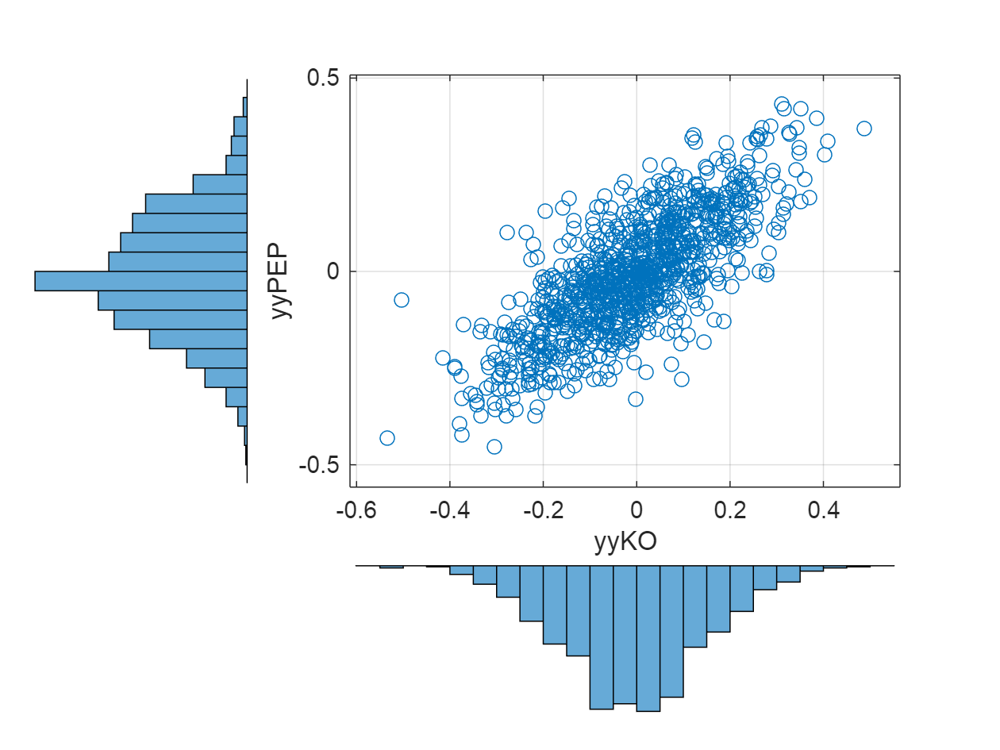
## Example 3: Fitting a t\-Distribution Copula
```matlab
% Fitting a Copula to Data ... example using t-dist Copula
 
vKO = ksdensity(rKO, rKO,'function','cdf');
vPEP = ksdensity(rPEP, rPEP,'function','cdf');
 
[RhoFit,nuFit] = copulafit('t',[vKO vPEP],'Method','ApproximateML')
```

```matlabTextOutput
RhoFit = 2x2
1.0000    0.7585
    0.7585    1.0000

nuFit = 3.1803
```

```matlab
uFit = copularnd('t',RhoFit,nuFit,1000);
uKO = uFit(:,1);
uPEP = uFit(:,2);
 
rFitKO = ksdensity(rKO,uKO,'function','icdf'); 
rFitPEP = ksdensity(rPEP,uPEP,'function','icdf');

figure()
scatterhist(uKO,uPEP,'Direction','out')
xlabel('vKO')
ylabel('vPEP')
set(get(gca,'children'),'marker','.')
grid on
```

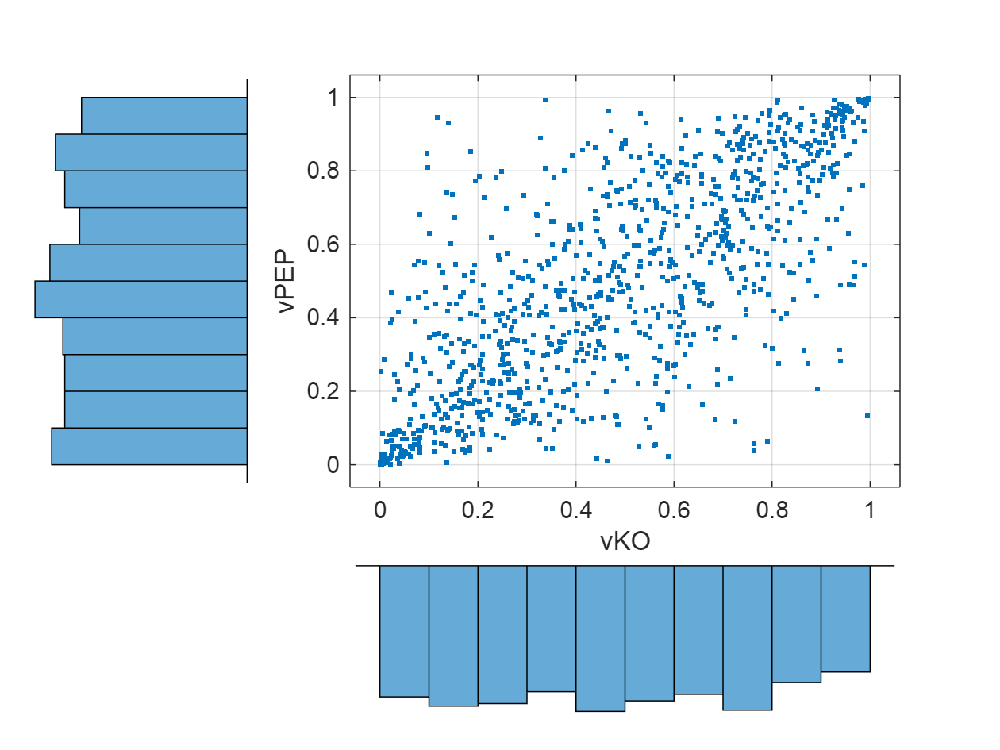

```matlab
figure()
set(gcf,'Position',[0,0,700,200])
 
subplot(1,4,1)
plot(uEcdfKO, uEcdfPEP, '.')
title('Actual Copula')
xlabel('ECDF(Returns KO)')
ylabel('ECDF(Returns PEP)')
ylim([0 1])
grid on
 
subplot(1,4,2)
plot(uKO,uPEP, '.')
title('Fitted t-Dist Copula')
xlabel('ECDF(Returns KO)')
ylabel('ECDF(Returns PEP)')
grid on
 
subplot(1,4,3)
plot(rFitKO, rFitPEP, '.')
title('Fitted JDF t-Dist Copula')
xlabel('Returns KO')
ylabel('Returns PEP')
xlim([-0.04 +0.04])
ylim([-0.04 +0.04])
grid on
 
subplot(1,4,4)
plot(rKO, rPEP, '.')
title('Actual Joint Distribution')
xlabel('Returns KO')
ylabel('Returns PEP')
xlim([-0.04 +0.04])
ylim([-0.04 +0.04])
grid on
```

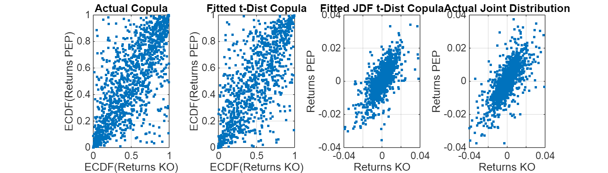

Is the Spread Relationship Maintained?

```matlab
figure()
set(gcf,'Position',[0,0,700,400])
plot(cumprod(1+rPEP) - cumprod(1+rKO), 'o')
hold on
plot(cumprod(1+rFitPEP) - cumprod(1+rFitKO), 'o')
plot(cumprod(1+yPEP) - cumprod(1+yKO), 'o')
hold off

xlabel('Days')
ylabel('Indicative Spread')
legend({'Actual','Copula Sim','Cholesky Sim'}, 'location', 'NorthWest')
grid on
```

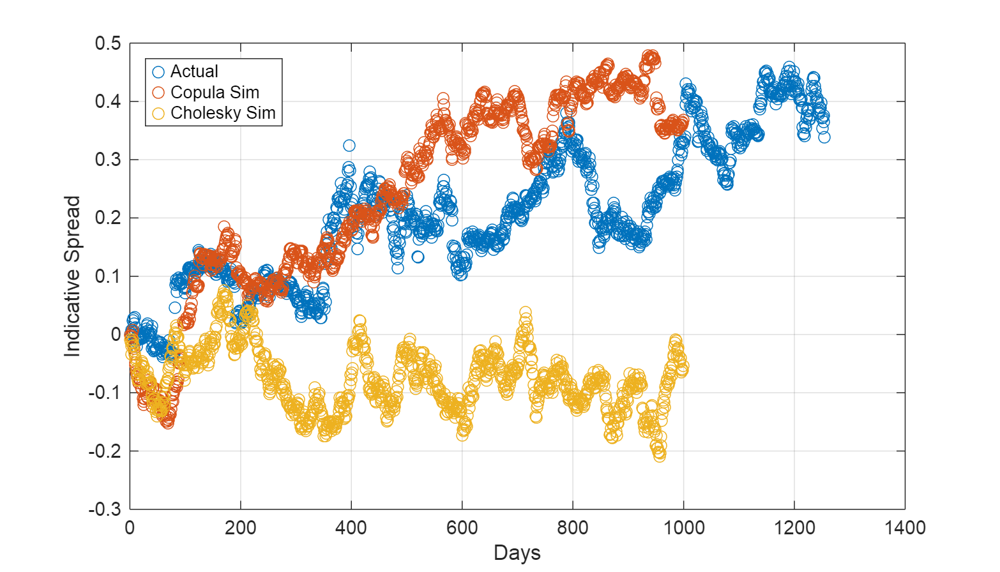
## Other Copula Shapes

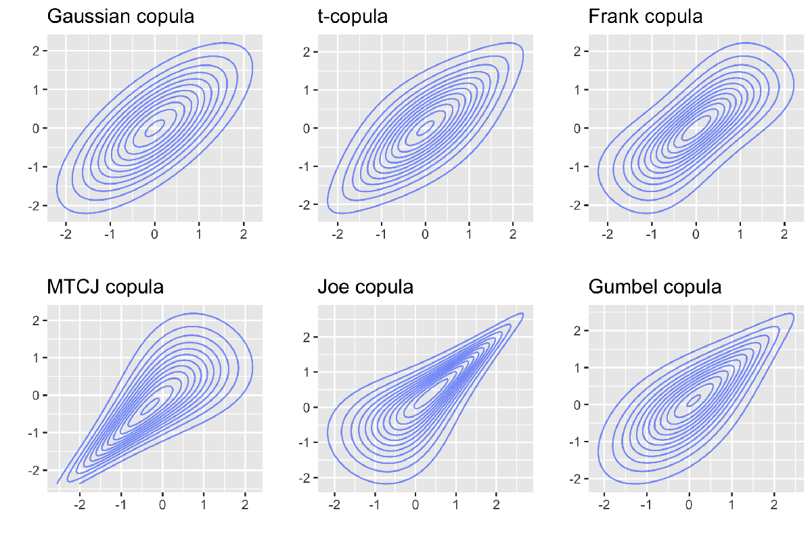

