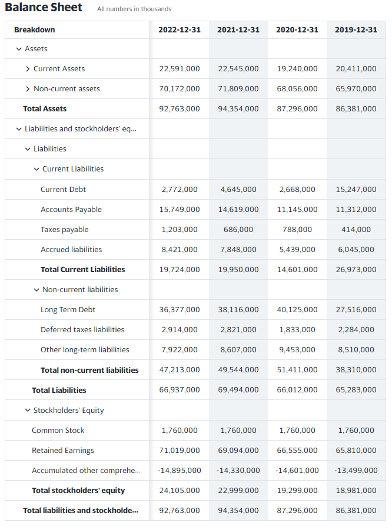
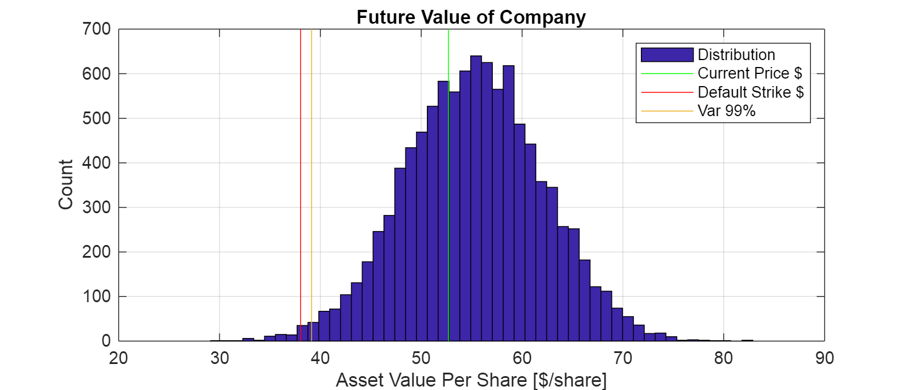
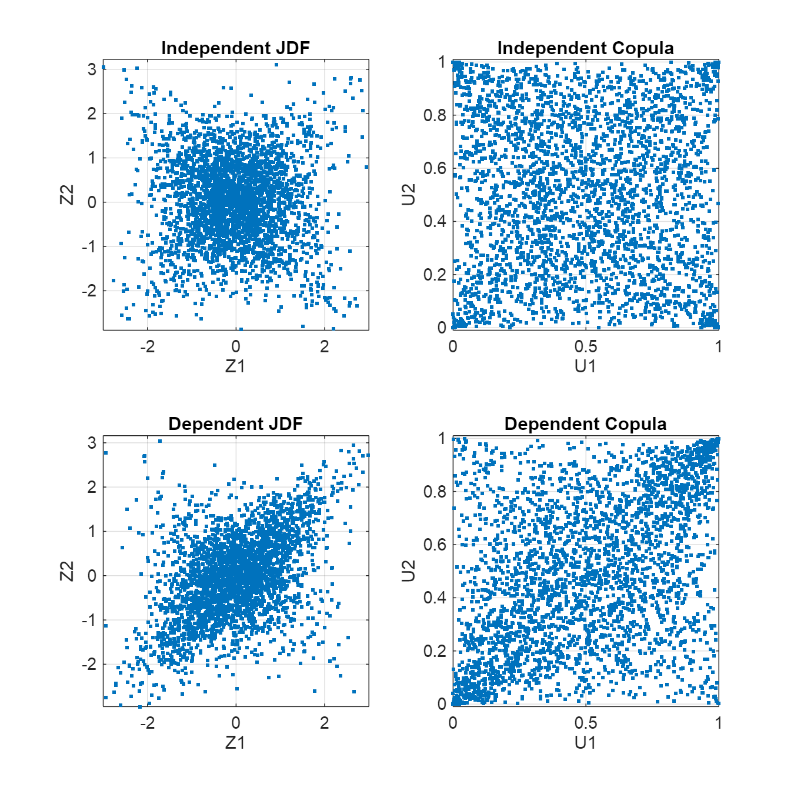
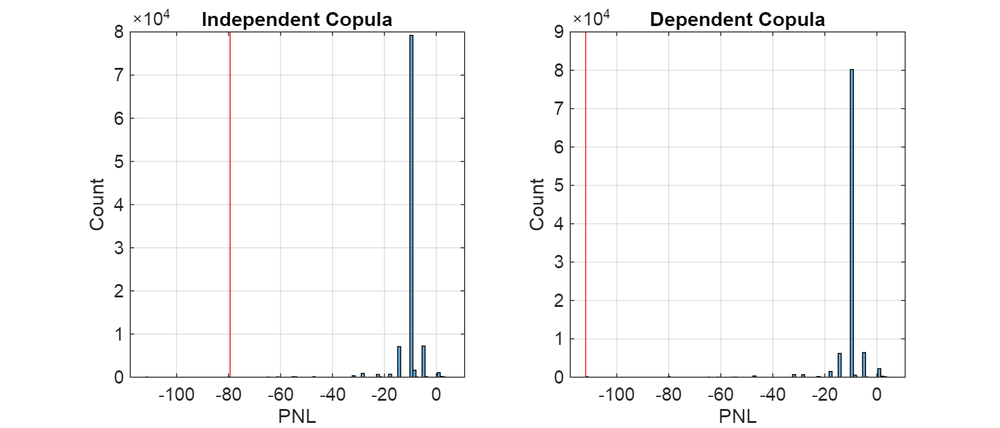

# Class 7 Credit Risk
```matlab
clc, clear all, close all
rng(1005778428);
```
# Problem
-  Simple Merton Model 
-  2 Bond Portfolio 
## A. Merton and KMV Model to Estimate Probability of Default
### KO Balance Sheet




Value = Equity + Debt

```matlab
% Define some Balance Sheet Variables
NStock = 1760000000;
 
%CurrentLiability = 19724000000;
CurrentLiability = 66937000000;
 
%CurrentAssets = 22591000000;
CurrentAssets = 92763000000;
 
Ao = CurrentAssets / NStock;
L = CurrentLiability / NStock;
 
So = 56; % not used
rf = 0.05; % not used
 
dt = 1; % year
NTrials = 10000;
 
% Assume a Recovery Rate
R = 0.5;
sigma = 0.13;
b = 0.05;
 
% The Geometric Random Walk ... we only need the last point for a European option, so this is just for continuity ... 
U = rand(NTrials,1);
Z = norminv(U);
A = Ao * (1 + b * dt + sigma * sqrt(dt) * Z);
 
% Calculate the Probability of Default
PD = length(find(A < L)) / NTrials * 10000 % in bps
```

```matlabTextOutput
PD = 62
```

```matlab
VAR99 = prctile(A, 1);
% Graphs and Results
figure()
set(gcf,'Position',[0,0,700,300])
hist(A,50)
hold on; 
line([Ao,Ao], get(gca,'YLim'), 'color', 'g');
line([L,L], get(gca,'YLim'), 'color', 'r');
line([VAR99,VAR99], get(gca,'YLim')); hold off
title('Future Value of Company')
xlabel('Asset Value Per Share [ !!!EQ_1!!! ', 'Default Strike $', 'Var 99%'})
grid on
```


## B. Using Copula to Solve Credit VaR
### Model Setup

Useful bond rating information:

```matlab
BondRating = ["AAA", "AA", "A", "BBB", "BB", "B", "C", "Default"];
Probability = [0.02 0.33 5.95 86.93 5.30 1.17 0.12 0.18] / 100;
CumProbability = cumsum(Probability,2,"reverse")';
BondValue = [109.37 109.19 108.66 107.55 102.02 98.10 83.64 51.13];
```

Pull a table together of this information:

```matlab
TblBond = table;
TblBond.Rating = BondRating';
TblBond.Probability = Probability';
TblBond.CumProbability = CumProbability;
TblBond.TrasitionValue = BondValue';
```

Define the boundaries of the Z\-matrix to model transitions:

```matlab
% Define the Marginal Distribution as N(0,1)

ZDefault = norminv(TblBond.Probability(8), 0, 1);
ZC = norminv(sum(TblBond.Probability(7:8)), 0, 1);
ZB = norminv(sum(TblBond.Probability(6:8)), 0, 1);
ZBB = norminv(sum(TblBond.Probability(5:8)), 0, 1);
ZBBB = norminv(sum(TblBond.Probability(4:8)), 0, 1);
ZA = norminv(sum(TblBond.Probability(3:8)), 0, 1);
ZAA = norminv(sum(TblBond.Probability(2:8)), 0, 1);
ZAAA = norminv(sum(TblBond.Probability(1:8)), 0, 1);

ZBoundary = [ZAAA, ZAA, ZA, ZBBB, ZBB, ZB, ZC, ZDefault];
 
% Add to table
TblBond.Z = ZBoundary'
```
| |Rating|Probability|CumProbability|TrasitionValue|Z|
|:--:|:--:|:--:|:--:|:--:|:--:|
|1|"AAA"|2.0000e-04|1|109.3700|NaN|
|2|"AA"|0.0033|0.9998|109.1900|3.5401|
|3|"A"|0.0595|0.9965|108.6600|2.6968|
|4|"BBB"|0.8693|0.9370|107.5500|1.5301|
|5|"BB"|0.0530|0.0677|102.0200|-1.4931|
|6|"B"|0.0117|0.0147|98.1000|-2.1781|
|7|"C"|0.0012|0.0030|83.6400|-2.7478|
|8|"Default"|0.0018|0.0018|51.1300|-2.9112|

### Generate Correlated Samples from Copula
```matlab
N = 100000;
 
DefaultRho = 0.5;
Tau = 2/pi * asin(DefaultRho); % not used
 
CIND = [1 0; 0 1];
CDEP = [1, DefaultRho; DefaultRho, 1];
 
%rng('default');  % For reproducibility
 
% % Mean Variance Approach
% ZIND = mvnrnd([0 0], CIND, N);
% ZDEP = mvnrnd([0 0], CDEP, N);
% 
% UIND = normcdf(ZIND);
% UDEP = normcdf(ZDEP);
 
% % Copula Approach
% UIND = copularnd('Gaussian', CIND, N);
% UDEP = copularnd('Gaussian', CDEP, N);
% 
% ZIND = norminv(UIND);
% ZDEP = norminv(UDEP);
 
% Copula Approach
nu = 2;
UIND = copularnd('t', CIND, nu, N);
UDEP = copularnd('t', CDEP, nu, N);
 
ZIND = norminv(UIND);
ZDEP = norminv(UDEP);
 
 
% Graphs and Results
ISample = 1:3000; % to reduce the memory to display scatterplots
 
figure()
set(gcf, 'Position', [0,0,600,600])
 
subplot(2,2,1)
plot(ZIND(ISample,1), ZIND(ISample,2), '.')
axis([-3 3 -3 3])
axis equal
grid on
title('Independent JDF')
xlabel('Z1')
ylabel('Z2')
 
subplot(2,2,2)
plot(UIND(ISample,1), UIND(ISample,2), '.')
axis([0 1 0 1])
axis equal
grid on
title('Independent Copula')
xlabel('U1')
ylabel('U2')
 
subplot(2,2,3)
plot(ZDEP(ISample,1), ZDEP(ISample,2), '.')
axis([-3 3 -3 3])
axis equal
grid on
title('Dependent JDF')
xlabel('Z1')
ylabel('Z2')
 
subplot(2,2,4)
plot(UDEP(ISample,1), UDEP(ISample,2), '.')
axis([0 1 0 1])
axis equal
grid on
title('Dependent Copula')
xlabel('U1')
ylabel('U2')
```


### Estimate the Probability of Default
```matlab
% Now that we have the samples of Z we can estimate the probability of
% default
 
% Assume we have 2 bonds of equal value
NBonds = 2;
CurrentValueBond = Probability * BondValue'
```

```matlabTextOutput
CurrentValueBond = 107.0879
```

```matlab
CurrentValueBond2 = CurrentValueBond * NBonds
```

```matlabTextOutput
CurrentValueBond2 = 214.1758
```

Prepare some stroage variables:

```matlab
FutureBondValueIND = NaN(N,2);
FutureBondValueDEP = NaN(N,2);
```

Prepare to account for defaults for every Monte Carlo sample:

```matlab
% we're going to skip the step where we convert from U -> Z and just create
% a uniform version of the z-boundaries in this variable 
CumProbabilityBoundary = [CumProbability; 0];
 
for i = 1:N
 
    % Independent Example
    IZ1 = find(CumProbabilityBoundary <= UIND(i,1), 1, "first");
    IZ2 = find(CumProbabilityBoundary <= UIND(i,2), 1, "first");
 
    FutureBondValueIND(i,:) = [BondValue(min(IZ1,8)), BondValue(min(IZ2,8))];
 
    % Dependent Example
    IZ1 = find(CumProbabilityBoundary <= UDEP(i,1), 1, "first");
    IZ2 = find(CumProbabilityBoundary <= UDEP(i,2), 1, "first");
 
    FutureBondValueDEP(i,:) = [BondValue(min(IZ1,8)), BondValue(min(IZ2,8))];
 
end%for j
 
% Portfolio PNL
PortfolioIND = sum(FutureBondValueIND, 2) - NBonds * CurrentValueBond; 
PortfolioDEP = sum(FutureBondValueDEP, 2) - NBonds * CurrentValueBond;

INDEL = mean(PortfolioIND)
```

```matlabTextOutput
INDEL = -10.5740
```

```matlab
DEPEL = mean(PortfolioDEP)
```

```matlabTextOutput
DEPEL = -10.5820
```

```matlab

% 99% Loss Estimates
INDVAR99 = prctile(PortfolioIND, 0.1)
```

```matlabTextOutput
INDVAR99 = -79.4058
```

```matlab
DEPVAR99 = prctile(PortfolioDEP, 0.1)
```

```matlabTextOutput
DEPVAR99 = -111.9158
```

```matlab
% Graphs and Results
figure()
set(gcf,'Position',[0,0,700,300])
 
subplot(1,2,1)
histogram(PortfolioIND,100)
hold on; line([INDVAR99,INDVAR99], get(gca,'YLim'), 'color', 'r'); hold off
title('Independent Copula')
ylabel('Count')
xlabel('PNL')
grid on
 
subplot(1,2,2)
histogram(PortfolioDEP,100)
hold on; line([DEPVAR99,DEPVAR99], get(gca,'YLim'), 'color', 'r'); hold off
title('Dependent Copula')
ylabel('Count')
xlabel('PNL')
grid on
```


