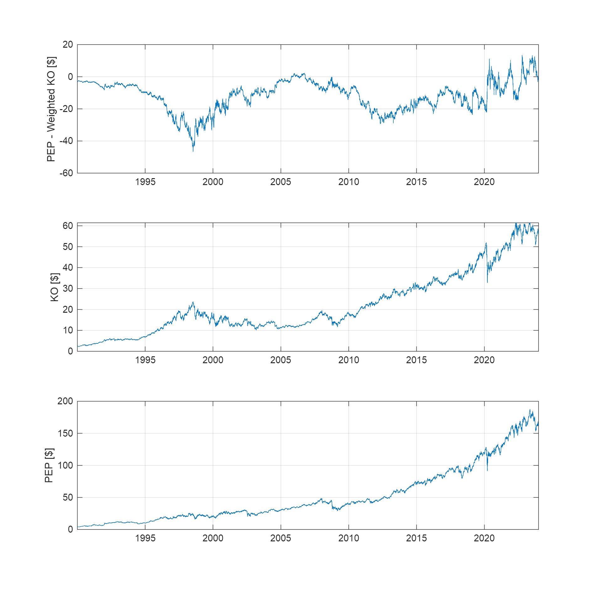
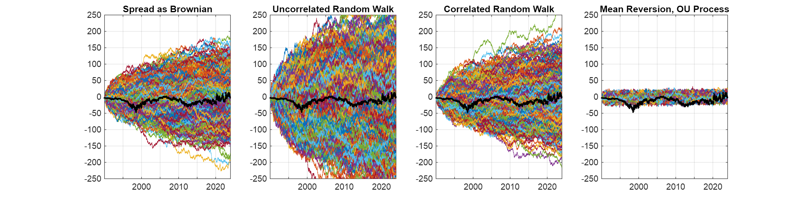
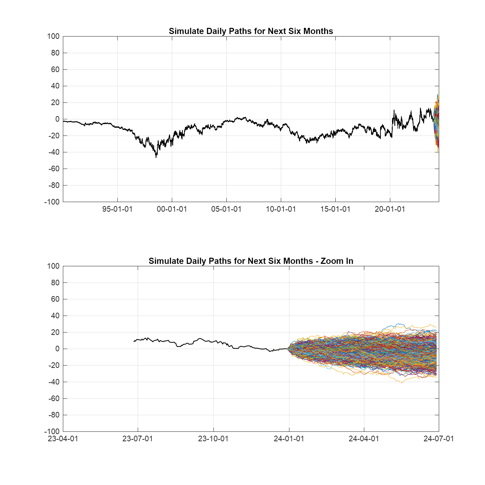

# Project 1 Pairs Trading \- Xinyi (Cynthia) Shen

Student Number: 1005778428

# The Problem

I got this on an interview question when I first graduated MMF. I had the evening to submit my answer.


Assume you have USD\$100,000. You are looking at trading Coke and Pepsi. Assume cash earns 5% per year in the bank.


On the **29th of December 2023**, at the close of the market, assume you short sell USD\$100,000 shares of Coke stock, use the proceeds to buy USD\$100,000 shares of Pepsi. Assume we held these numbers of shares all the time:


 $00,000 shares of Coke stock and use the proceeds to buy USD\$100,000 shares of Pepsi. Assume we held these numbers of shares all the time:\begin{center}$ \textrm{KO}\;\textrm{shares}=\frac{100,000}{P_{KO} } $ and $ \textrm{PEP}\;\textrm{shares}=\frac{100,000}{P_{PEP} } $ \end{center}\begin{flushleft}Then the spread for this pairs trade is the difference between the price of PEP and the weighted price of KO, where the weight accounts for the relative number of shares:\end{flushleft}$ $\textrm{Weight}\;\textrm{of}\;\textrm{KO}=\frac{\textrm{KO}\;\textrm{shares}}{\textrm{PEP}\;\textrm{shares}}$ $\begin{flushleft}We plot:\end{flushleft}\begin{itemize}\setlength{\itemsep}{-1ex}   \item{\begin{flushleft} the spread of long Pepsi and weighted short Coke: $ \textrm{spread}=P_{PEP} \-P_{KO} \times \textrm{Weight}\;\textrm{of}\;\textrm{KO} $ \end{flushleft}}   \item{\begin{flushleft} the individual Coke \end{flushleft}}   \item{\begin{flushleft} the individual Pepsi \end{flushleft}}\end{itemize}
 
 ```matlab% Timet = datetime(TT.Date);
% Time
t = datetime(TT.Date);

% Define date of entering pair trade
startDate = datetime(2023, 12, 29);

% Find the index for start date
index_dec29_2023 = find(TT.Date == startDate);

% KO and PEP stock prices
ko = TT.KO;
pep = TT.PEP;

% Numbers of shares held
shares_ko = 100000/ko(index_dec29_2023);
shares_pep = 100000/pep(index_dec29_2023);

% Weight of KO
weight = shares_ko/shares_pep;

% Weighted spread (price differential)
spread = pep - ko * weight;

figure()
set(gcf, 'Position', [0 0 1000 1000])
 
subplot(3,1,1)
plot(t, spread)
xtickformat('yyyy')
ylabel('PEP - Weighted KO [$]')
grid on
 
subplot(3,1,2)
plot(t, ko)
xtickformat('yyyy')
ylabel('KO [$]')
grid on
 
subplot(3,1,3)
plot(t, pep)
xtickformat('yyyy')
ylabel('PEP [$]')
grid on
```


## Choose Model

Considering Actual as Brownian, Uncorrelated Model, Correlated Model, and Mean\-Reverting Model, we impletment all the four models based on the historical stock data and use a smaller number of daily simulating paths, 1,000, for simplicity.

### Parameters
```matlab
NTrials = 1000;
NSteps = length(t);
dt = 1/252;
KO_initial = ko(1) * weight;
PEP_initial = pep(1);
spread_initial = spread(1);
rng(1005778428);
```
### Model 1: Spread as Brownian

We model the Geometric Brownian Motion for PEP \- KO spread.


Since we are modelling the spread of PEP \- KO, which could be positive or negative, we assume that the spread follows a **normal** distribution.


By simulating paths using the cumulative sum, the formula here is a simplified version of GBM:


 $S_{t+1} =S_t +\mu +\sigma Z_t$ where $Z_t \sim \mathcal{N}(0,1)$ 

```matlab
dSpread = diff(spread);
mu_dSpread = mean(dSpread);
sigma_dSpread = std(dSpread);
U = rand(NSteps, NTrials);
Z = norminv(U);
spread_brownian = spread_initial + cumsum(mu_dSpread + sigma_dSpread * Z);
```
### Model 2: Uncorrelated Random Walk

KO and PEP are modeled with independent random walks, meaning their price movements are uncorrelated with each other.

 $$ S_{t+1}^{KO} =S_t^{KO} +\mu_{KO} +\sigma_{KO} Z_t $$ 

 $$ S_{t+1}^{PEP} =S_t^{PEP} +\mu_{PEP} +\sigma_{PEP} Z_t $$ 

where $Z_{KO,t} $ and $ Z_{PEP,t}$ are independent.

```matlab
dPEP = diff(pep);
mu_dPEP = mean(dPEP);
sigma_dPEP = std(dPEP);
U = rand(NSteps, NTrials);
Z = norminv(U);
PEP_uncorrelated = PEP_initial + cumsum(mu_dPEP + sigma_dPEP * Z);

dKO = diff(ko * weight);
mu_dKO = mean(dKO);
sigma_dKO = std(dKO);
U = rand(NSteps, NTrials);
Z = norminv(U);
KO_uncorrelated = KO_initial + cumsum(mu_dKO + sigma_dKO * Z);

spread_uncorrelated = PEP_uncorrelated - KO_uncorrelated;
```
### Model 3: Correlated Random Walk

The formula for generating two correlated Wiener processes is:

 $$ Z_1 (t)=W_1 (t) $$ 

 $$ Z_2 (t)=\rho W_1 (t)+\sqrt{1-\rho^2 }W_2 (t) $$ 

This ensures that the correlation between $Z_1 (t) $ and $ Z_2 (t)$ is $\rho$ .

```matlab
% Uniform random variables for Wiener Process
u1 = rand(NSteps, NTrials);
u2 = rand(NSteps, NTrials);

% Normally distributed random variables for Wiener Process
w1 = norminv(u1);
w2 = norminv(u2);

% Correlation matrix between PEP daily changes and KO daily changes
C = corrcoef([dPEP dKO]);

% Find the Cholesky Decomposition
L = chol(C, 'upper');

% Correlate the Wiener processes
z1 = zeros(size(w1));
z2 = zeros(size(w2));
for i = 1:NTrials
    zTemp = [w1(:,i) w2(:,i)] * L; % apply Cholesky factor to correlate w1 and w2
    z1(:,i) = zTemp(:,1); % extract correlated z1
    z2(:,i) = zTemp(:,2); % extract correlated z2
end

PEP_correlated = PEP_initial + cumsum(mu_dPEP + sigma_dPEP * z1);
KO_correlated = KO_initial + cumsum(mu_dKO + sigma_dKO * z2);

spread_correlated = PEP_correlated - KO_correlated;
```
### Model 4: Ornstein\-Uhlenbeck (OU) Process

The mean\-reverting model assumes that prices tend to revert to a long\-term mean over time.


The **Ornsteim\-Uhlenbeck (OU) process** is a stochastic differential equation (SDE) that models a mean\-reverting process:

 $$ dX=a(b-X)dt+\sigma dW $$ 

where

-  $X$ is the process (in this case, detrended spread) 
-  $a$ is the **speed of mean reversion**. It controls how quickly the process reverts to the long\-term mean $b$ 
-  $b$ is the **long\-term mean** (in this case, the mean of the detrended spread) 
-  $\sigma$ is the volatility of the process 
-  $dW$ is a Wiener process (standard Brownian motion), providing the random shocks 
```matlab
trend = spread_initial + mu_dSpread * linspace(0, NSteps, NSteps)'; % trend
spreadDetrend = spread - trend; % detrend
dSpreadDetrend = diff(spreadDetrend);

a = 0.005; % speed of mean reversion
mu = mean(dSpreadDetrend); % mean of the detrended spread
sigma = std(dSpreadDetrend); % volatility

U = rand(NSteps, NTrials);
Z = norminv(U);
X_OU = zeros(size(U)); % initialize OU process simulation
X_OU(1,:) = spreadDetrend(1); % set initial value the initial value of detrended spread
for i = 2:NSteps
    X_OU(i,:) = X_OU(i-1,:) + mu - a * X_OU(i-1,:) + sigma * Z(i,:);
end
X_OU_Trend = X_OU + trend;
```
### Plot and Compare the Four Models
```matlab
figure
set(gcf, 'Position', [0 0 1200 300])

% Spread
subplot(1,4,1)
plot(t, spread_brownian)
title('Spread as Brownian')
xtickformat('yyyy')
grid on
hold on
plot(t, spread,'ko','MarkerSize',1)
hold off
ylim([-250 250])

% Uncorrelated
subplot(1,4,2)
plot(t, spread_uncorrelated)
title('Uncorrelated Random Walk')
xtickformat('yyyy')
grid on
hold on
plot(t, spread, 'ko', 'MarkerSize',1)
hold off
ylim([-250 250])

% Correlated
subplot(1,4,3)
plot(t, spread_correlated)
title('Correlated Random Walk')
xtickformat('yyyy')
grid on
hold on
plot(t, spread, 'ko', 'MarkerSize',1)
hold off
ylim([-250 250])

% Mean-Reversion
subplot(1,4,4)
plot(t, X_OU_Trend)
title('Mean Reversion, OU Process')
xtickformat('yyyy')
grid on
hold on
plot(t, spread, 'ko', 'MarkerSize',1)
hold off
ylim([-250 250])
```



 **Observation:** The mean\-reverting Ornstein\-Unlenbeck process seems to capture the real spread best among the four models. KO and PEP are highly correlated companies in the same industry. Their prices tend to move together over time, with deviations in the spread being short\-lived and often reverting to a historical mean. The Ornstein\-Unlenbeck process captures this feature effectly, whereas the other models assume random or drift\-based divergence, which is less realistic for related companies. The brownian motion, uncorrelated, and correlated random walks do not prevent the spread from diverging infinitely over time. This is not realistic for pairs like KO and PEP, where competitive and economic forces tend to keep the prices in a related range. The mean\-reversion model, on the other hand, prevents this unlimited divergence by pulling the spread back towards its long\-term average. If you observe the real spread over time, it likely oscillates around a long\-term mean value, with short\-term deviations. The mean\-reversion model is designed to mimic this behavior, and that's why it produces simulated paths that track the real spread more closely than the other models.


**Conclusion:** The mean\-reversion model (Ornstein\-Unlenbeck process) is particularly well\-suited for modelling the spread in the pair trading of selling Coke and buying Pepsi.

## Simulate Daily Paths for Next Six Months when Entering Pair Trade on December 29, 2023
```matlab
% Calculate the number of trading days
days = startDate:caldays(1):datetime(2024,6,30);
business_days = days(isweekend(days) == 0); % Exclude weekends
num_trading_days = numel(business_days);
fprintf('Number of trading days from Dec 29, 2023, to June 30, 2024: %d\n', num_trading_days);
```

```matlabTextOutput
Number of trading days from Dec 29, 2023, to June 30, 2024: 131
```

```matlab

% Forecast simulation parameters
NTrials_sim = 1000;
NSteps_sim = num_trading_days;

% Detrend spread
trend_sim = spread(index_dec29_2023) + mu_dSpread * linspace(0, NSteps_sim, NSteps_sim)'; % trend
spreadDetrend_sim = spread(index_dec29_2023-NSteps_sim+1:index_dec29_2023) - trend_sim; % detrend
dSpreadDetrend_sim = diff(spreadDetrend_sim);

% OU Process parameters
a = 0.005; % speed of mean reversion
mu_sim = mean(dSpreadDetrend_sim); % mean of the detrended spread, b
sigma_sim = std(dSpreadDetrend_sim); % volatility

% OU Process initialization
U = rand(NSteps_sim, NTrials_sim);
Z = norminv(U);
spread_sim = zeros(size(U)); % initialize OU process simulation
spread_sim(1,:) = spreadDetrend_sim(end); % set initial value the initial value of detrended spread

% OU Process
for i = 2:NSteps_sim
    spread_sim(i,:) = spread_sim(i-1,:) + mu_sim - a * spread_sim(i-1,:) + sigma_sim * Z(i,:);
end
spread_sim_trend = spread_sim + trend_sim;

% Add 60 trading days
t_next = startDate;
for i = 1:(num_trading_days-1)
    t_next(end+1) = t_next(end) + caldays(1); % add one day
    while isweekend(t_next(end))
        t_next(end) = t_next(end) + caldays(1); % if the day is Saturday or Sunday, move to Monday
    end
end
t_next = t_next';

% Plot simulation
figure
set(gcf, 'Position', [0 0 1000 1000])

subplot(2,1,1)
plot(t_next, spread_sim_trend)
title('Simulate Daily Paths for Next Six Months')
xtickformat('yy-MM-dd')
grid on
hold on
plot(t, spread, 'k-', 'Linewidth', 1)
hold off
ylim([-100 100])

subplot(2,1,2)
plot(t_next, spread_sim_trend)
title('Simulate Daily Paths for Next Six Months - Zoom In')
xtickformat('yy-MM-dd')
grid on
hold on
plot(t(end-num_trading_days+1:end), spread(end-num_trading_days+1:end), 'k-', 'Linewidth', 1)
hold off
ylim([-100 100])
```


## **January 31, 2024**
```matlab
% Calculate the number of trading days
days_Jan31 = startDate:caldays(1):datetime(2024,1,31);
business_days_Jan31 = days_Jan31(isweekend(days_Jan31) == 0); % Exclude weekends
num_trading_days_Jan31 = numel(business_days_Jan31);
fprintf('Number of trading days from Dec 29, 2023, to January 31, 2024: %d\n', num_trading_days_Jan31);
```

```matlabTextOutput
Number of trading days from Dec 29, 2023, to January 31, 2024: 24
```
### Expected Value
```matlab
PnL_Jan31 = spread_sim_trend(num_trading_days_Jan31,:) - spread_sim_trend(1,:)*(1+r)^(num_trading_days_Jan31/252);
expected_PnL_Jan31 = mean(PnL_Jan31)
```

```matlabTextOutput
expected_PnL_Jan31 = -1.1910
```

If we enter the trade on December 29, 2023, the expected profit/loss of a single pair trade on January 31, 2024 is \-\$1.19.

```matlab
r = 0.05;
FV_Jan31 = expected_PnL_Jan31*shares_pep + 100000*(1+r)^(num_trading_days_Jan31/252)
```

```matlabTextOutput
FV_Jan31 = 9.9748e+04
```

Since we have \$100,000 cash in the bank and the risk\-free interest rate is 5%, the expected future value of the total portfolio on January 31, 2024 is \$99,748.

### 5th and 95th Percentile Profit or Loss
```matlab
percentile_5th_Jan31 = prctile(PnL_Jan31, 5)
```

```matlabTextOutput
percentile_5th_Jan31 = -9.6370
```

```matlab
percentile_95th_Jan31 = prctile(PnL_Jan31, 95)
```

```matlabTextOutput
percentile_95th_Jan31 = 6.8950
```

The 5th percentile profit or loss is -\$9.64, and the 95th percentile profit or loss is \$6.90.

### Price Differential to Enter and Exit Pair Trade
```matlab
confidence_level = 0.95;
alpha = 1 - confidence_level;
z = norminv(1 - alpha/2);
mu_PriceDifferential_Jan31 = mean(spread_sim_trend(num_trading_days_Jan31,:))
```

```matlabTextOutput
mu_PriceDifferential_Jan31 = -1.2371
```

```matlab
LowerEntry_Jan31 = mean(spread_sim_trend(num_trading_days_Jan31,:)) - z*std(spread_sim_trend(num_trading_days_Jan31,:))
```

```matlabTextOutput
LowerEntry_Jan31 = -10.9340
```

By setting a $95\%$ confidence level, during December 29, 2023 to January 31, 2024, the ideal entry for long Pepsi and short Coke would be when the spread is less than or equal to $\mu -1.96\sigma =-$ 10.93 $, and we may want to exit the pair trade when the weighted spread reverts back to or above $ \mu =\- $1.24$ .

## **June 30, 2024**
### Expected Value
```matlab
PnL_Jun30 = spread_sim_trend(num_trading_days,:) - spread_sim_trend(1,:)*(1+r)^(num_trading_days/252);
expected_PnL_Jun30 = mean(PnL_Jun30)
```

```matlabTextOutput
expected_PnL_Jun30 = -5.7865
```

If we enter the trade on December 29, 2023, the expected profit/loss of a single pair trade on June 30, 2024 is -\$5.79.

```matlab
r = 0.05;
FV_Jun30 = expected_PnL_Jun30*shares_pep + 100000*(1+r)^(num_trading_days/252)
```

```matlabTextOutput
FV_Jun30 = 9.9082e+04
```

Since we have \$100,000 cash in the bank and the risk-free interest rate is 5%, the expected future value of the total portfolio on June 30, 2024 is \$99,082.

### 5th and 95th Percentile Profit or Loss
```matlab
percentile_5th_Jun30 = prctile(PnL_Jun30, 5)
```

```matlabTextOutput
percentile_5th_Jun30 = -21.4507
```

```matlab
percentile_95th_Jun30 = prctile(PnL_Jun30, 95)
```

```matlabTextOutput
percentile_95th_Jun30 = 9.1778
```

The 5th percentile profit or loss is \-\$21.45, and the 95th percentile profit or loss is \$9.18.

### Price Differential to Enter and Exit Pair Trade
```matlab
confidence_level = 0.95;
alpha = 1 - confidence_level;
z = norminv(1 - alpha/2);
mu_PriceDifferential_Jun30 = mean(spread_sim_trend(num_trading_days,:))
```

```matlabTextOutput
mu_PriceDifferential_Jun30 = -5.8336
```

```matlab
LowerEntry_Jun30 = mean(spread_sim_trend(num_trading_days,:)) - z*std(spread_sim_trend(num_trading_days,:))
```

```matlabTextOutput
LowerEntry_Jun30 = -23.9851
```

By setting a $95\%$ confidence level, during December 29, 2023 to June 30, 2024, the ideal entry for long Pepsi and short Coke would be when the spread is less than or equal to $\mu -1.96\sigma =-$ 23.99 $, and we may want to exit the pair trade when the weighted spread reverts back to or above $ \mu =\- $5.83$ .

